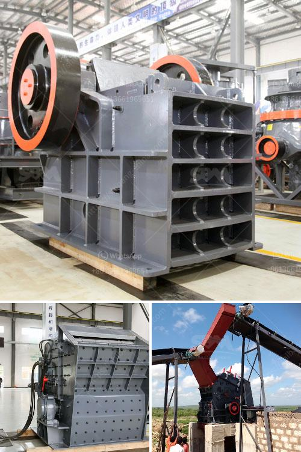

<h3>crusher and screen plant for sale japan</h3>
Crusher and screen plants are essential machinery used for crushing and screening various materials and minerals in construction and mining industries. These plants are highly versatile and can be used for processing a wide range of materials, including rocks, ores, and minerals. In Japan, there is a diverse market for crusher and screen plants, with various manufacturers offering their products for sale.

One of the key players in the Japanese market is Crusher Corporation, known for its high-quality crushers and screens. The company offers a wide range of crusher and screen plant models, each designed to meet specific requirements and deliver efficient performance. These plants are not only durable but also come with advanced features to enhance productivity and reduce downtime.

When considering a crusher and screen plant for sale in Japan, it is important to determine the specific needs and requirements of your project. Factors such as the type and size of the material to be processed, production capacity, and desired final product specifications should be taken into account. Consulting with experts and understanding the features of different models can help in making an informed decision.

In addition to Crusher Corporation, other Japanese manufacturers such as Komatsu and Hitachi also offer crusher and screen plants for sale. These companies have established a strong reputation for providing reliable and efficient machinery, backed by excellent after-sales support.

It is worth mentioning that buying crusher and screen plants from renowned Japanese manufacturers not only ensures quality and performance but also allows for easy availability of spare parts and maintenance services. This can prove to be advantageous in the long run, as it helps in reducing downtime and maximizing productivity.

In conclusion, crusher and screen plants are essential machinery for crushing and screening materials in various industries. The Japanese market offers a wide range of options for those in need of these plants, with manufacturers like Crusher Corporation, Komatsu, and Hitachi providing high-quality products. It is crucial to assess project requirements and consult experts to choose the most suitable plant for sale in Japan, ensuring efficient operations and long-term benefits.
<h3>Contact us</h3><ul><li><strong>Whatsapp:&nbsp;<a href="https://wa.me/8613661969651">+8613661969651</a></strong></li><li><a href="https://swt.shibang-china.com/?git&amp;zhl&amp;crusher and screen plant for sale japan"><strong>Online Service(chat now)</strong></a></li></ul><h3>Related</h3><ul><li><a href='crusher crusher run for sale in sabah.md'>crusher crusher run for sale in sabah</a></li><li><a href='sand making machine roller mill.md'>sand making machine roller mill</a></li><li><a href='coconut shell powder making machine grinding mill for sale.md'>coconut shell powder making machine grinding mill for sale</a></li><li><a href='total process of gypsum powder plant.md'>total process of gypsum powder plant</a></li><li><a href='raymond mill roll asembley.md'>raymond mill roll asembley</a></li></ul>