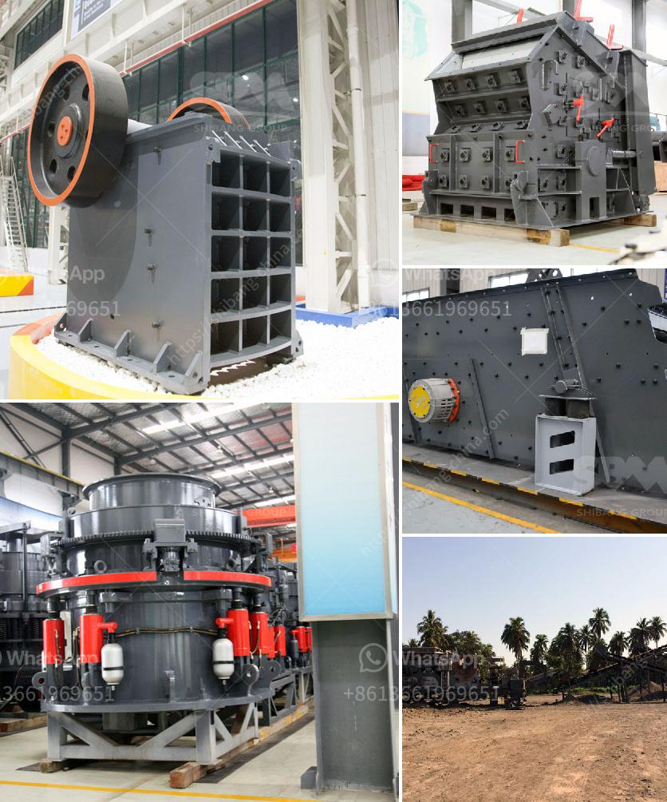

<h3>crusher and wash plant for sale in china</h3>
China has been experiencing rapid economic growth for the past few decades, resulting in an increased demand for construction materials such as aggregates. This has led to the rise in the number of crusher and wash plant manufacturers in the country, providing a diverse range of machines for sale. These equipment are crucial in the production of high-quality aggregates, making them a valuable asset for construction companies and mining operators.

Crushers are mechanical devices designed to break larger rocks into smaller, more manageable sizes. They are commonly used in the mining and construction industries to facilitate the crushing process, allowing the extracted materials to be transformed into usable aggregates. There are various types of crushers available, including jaw crushers, impact crushers, cone crushers, and gyratory crushers. Each type has its own unique features and advantages, catering to different material requirements and production capacities.

Wash plants, on the other hand, are specialized machines used to clean and separate materials, particularly in the aggregate and mining industries. They are employed to remove impurities and contaminants from the crushed materials, ensuring that the final product meets the required specifications. Wash plants typically include components such as screens, washing units, dewatering screens, and classifiers, which work together to achieve effective material separation and purification.

In China, there is a wide selection of crusher and wash plant manufacturers offering equipment for sale. These companies strive to provide innovative solutions that meet the evolving needs of the industry. Many of them have invested heavily in research and development to improve the efficiency, productivity, and environmental sustainability of their machines. As a result, Chinese crusher and wash plants are known for their advanced technology, robust construction, and reliable performance.

One of the key advantages of purchasing crusher and wash plants from China is the competitive pricing. Due to the country's mass production capabilities and efficient supply chain, Chinese manufacturers are able to offer their equipment at competitive prices without compromising on quality. This makes it attractive for construction companies and mining operators to consider purchasing equipment from China, as it allows them to achieve cost savings while obtaining reliable and high-quality machinery.

Furthermore, Chinese manufacturers often offer after-sales support and services, including installation, training, and maintenance. This ensures that customers can maximize the performance and lifespan of their crusher and wash plants, further enhancing the value proposition of purchasing from China. Additionally, spare parts and components are readily available, minimizing downtime and ensuring uninterrupted production.

In conclusion, the crusher and wash plant industry in China offers a wide range of equipment for sale that caters to the growing demand for aggregates. Chinese manufacturers are known for their advanced technology, competitive pricing, and after-sales support. Investing in crusher and wash plants from China can provide construction companies and mining operators with reliable and cost-effective solutions to meet their material production requirements.
<h3>Contact us</h3><ul><li><strong>Whatsapp:&nbsp;<a href="https://wa.me/8613661969651">+8613661969651</a></strong></li><li><a href="https://swt.shibang-china.com/?git&amp;zhl&amp;crusher and wash plant for sale in china"><strong>Online Service(chat now)</strong></a></li></ul><h3>Related</h3><ul><li><a href='ball mills brands.md'>ball mills brands</a></li><li><a href='petitpierre 20tph rapport de projet.md'>petitpierre 20tph rapport de projet</a></li><li><a href='sand screen with vibrator.md'>sand screen with vibrator</a></li><li><a href='copper slag grinding machine in chennai.md'>copper slag grinding machine in chennai</a></li><li><a href='stationary crushers and screens.md'>stationary crushers and screens</a></li></ul>