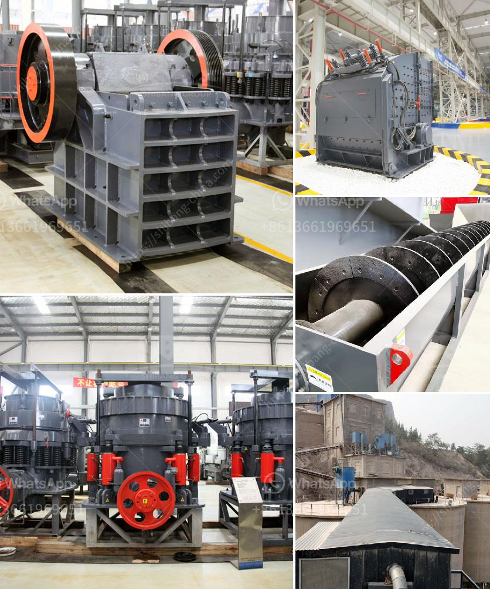

<h3>crusher business for sale in oman</h3>
There is a strong demand for businesses in Oman in the mining and construction industry. The crusher business is a thriving one due to the increasing demand for aggregates, a key material in road construction and building projects. With the booming construction industry in Oman, there is a large demand for crushers of all types, sizes, and capacities.

Starting a crusher business can be a lucrative venture for different reasons. First, it allows the owner to tap into the aggregate market, which is driven by the infrastructure development projects in Oman. Secondly, crusher businesses generate revenue from selling the crushed materials to construction companies and government agencies.

When considering buying a crusher business for sale in Oman, it is important to evaluate the options and choose the one that best suits your needs and budget. There are several factors to consider, such as the size and capacity of the crusher, the estimated revenue and profitability, and the location of the business.

Another crucial factor to consider is the regulations and permits required to operate a crusher business in Oman. It is essential to ensure that all necessary licenses are obtained, and the business complies with environmental and safety regulations.

The crusher business for sale in Oman offers an excellent opportunity for investors and quarry operators. With a wide range of crusher machines that are manufactured to meet the specific requirements of the project, we have a diversified range of crushers for sale in Oman.

Whether you are looking for a small or large crusher business for sale, we can help you find the right fit for your needs. Our team of experts is dedicated to assisting potential buyers in their search for the perfect crusher business opportunity.

With the growing construction market in Oman, investing in a crusher business can be a profitable venture. Contact us today to explore the available crusher businesses for sale in Oman and find the one that aligns with your goals and aspirations in the construction industry.
<h3>Contact us</h3><ul><li><strong>Whatsapp:&nbsp;<a href="https://wa.me/8613661969651">+8613661969651</a></strong></li><li><a href="https://swt.shibang-china.com/?git&amp;zhl&amp;crusher business for sale in oman"><strong>Online Service(chat now)</strong></a></li></ul><h3>Related</h3><ul><li><a href='manufacturer of jaw crusher.md'>manufacturer of jaw crusher</a></li><li><a href='france used conveyor belts for sale.md'>france used conveyor belts for sale</a></li><li><a href='china crusher plant.md'>china crusher plant</a></li><li><a href='calcium carbonate micronized plants.md'>calcium carbonate micronized plants</a></li><li><a href='chrome crusher for sale south africa.md'>chrome crusher for sale south africa</a></li></ul>