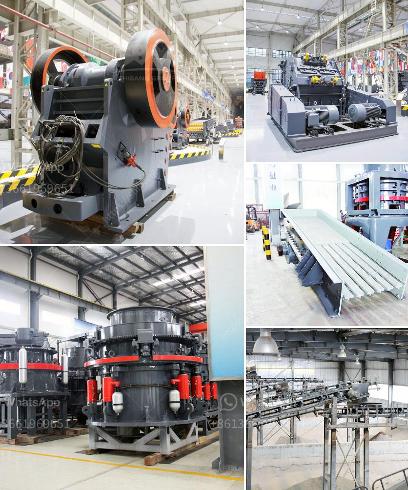

<h3>crusher conveyor philippines</h3>
In the mining and construction industries, bulk materials play a crucial role in the production process. These materials need to be transported efficiently from one location to another, and that's where crusher conveyors come into play. The Philippines, known for its rich mineral resources, has seen a growing demand for reliable conveyor systems to improve productivity and safety in mining operations.

A crusher conveyor system consists of a belt, which is looped around two or more pulleys, sometimes referred to as drums, with an endless loop of carrying medium. The belt moves over the pulleys, allowing the materials to be transported from one point to another. This type of system can handle a wide range of materials, including ores, aggregates, coal, and even industrial waste.

One of the key advantages of using crusher conveyors is their ability to handle large volumes of material with minimal labor and manual handling. This results in improved productivity and reduced operational costs. By eliminating the need for manual transportation of materials, companies can optimize their workflow and allocate their resources more efficiently.

Moreover, crusher conveyors offer enhanced safety features compared to traditional manual handling methods. With proper guarding and safety devices in place, the risk of accidents and injuries associated with material handling can be significantly reduced. This is especially important in the Philippines, where the government is prioritizing worker safety and compliance with occupational health and safety regulations.

In addition to their efficiency and safety advantages, crusher conveyors are also designed for durability and longevity. They are built to withstand harsh operating conditions, such as extreme temperatures and heavy loads. This ensures that companies can rely on these systems for long-term use, resulting in a greater return on investment.

The demand for crusher conveyor systems in the Philippines is expected to grow in the coming years as the mining and construction industries continue to expand. Companies are looking for reliable solutions that can handle their material transportation needs efficiently and safely. With their proven track record and numerous benefits, crusher conveyors are indeed the ideal choice for bulk material handling in the Philippines.
<h3>Contact us</h3><ul><li><strong>Whatsapp:&nbsp;<a href="https://wa.me/8613661969651">+8613661969651</a></strong></li><li><a href="https://swt.shibang-china.com/?git&amp;zhl&amp;crusher conveyor philippines"><strong>Online Service(chat now)</strong></a></li></ul><h3>Related</h3><ul><li><a href='stone crusher hyderabad.md'>stone crusher hyderabad</a></li><li><a href='stone quarries cursher south africa.md'>stone quarries cursher south africa</a></li><li><a href='jaw crusher pe 250 x 400.md'>jaw crusher pe 250 x 400</a></li><li><a href='mica powder mill equipment supplier.md'>mica powder mill equipment supplier</a></li><li><a href='crushed gravel supplier in negros oriental.md'>crushed gravel supplier in negros oriental</a></li></ul>