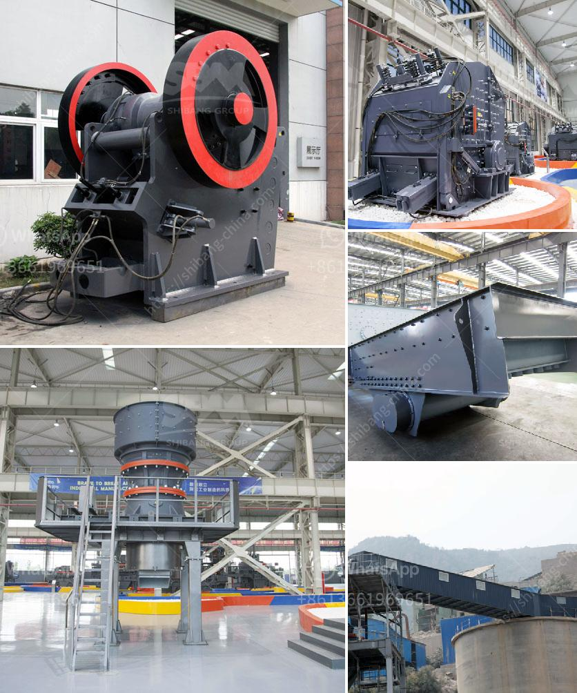

<h3>crusher crusher run for sale in sabah</h3>
Crusher run is a widely utilized material in construction projects, especially in building highways, bridges, and other infrastructure projects. As a reliable and affordable option, crusher run is often chosen for its compatibility with various types of terrain and its ability to withstand heavy loads. In Sabah, Malaysia, crusher run is readily available and offers significant benefits for construction purposes.

One of the primary advantages of crusher run is its durability. Made from crushed stone and stone dust, this material is known for its ability to withstand harsh weather conditions and heavy traffic. It is often used as a base layer beneath concrete and asphalt surfaces to provide stability and prevent erosion. By creating a solid foundation, crusher run ensures that the structure remains intact and prevents costly repairs in the long run.

Another advantage of crusher run is its versatility. Whether you need to create a driveway, pathway, or parking lot, this material can adapt to various applications. Its consistency and compact nature make it easy to spread and level by hand or with heavy machinery. Furthermore, crusher run can be easily blended with other materials, such as sand or cement, to enhance its properties depending on the specific project requirements.

Cost-effectiveness is yet another reason why crusher run is sought after in Sabah. Compared to other materials like gravel or limestone, crusher run is relatively affordable. Its availability in large quantities makes it a cost-effective option for construction projects of any scale. Moreover, due to its durability, the need for maintenance or replacement is significantly reduced, leading to further cost savings for the project.

In Sabah, crusher run is widely available for sale, ensuring a constant supply for construction needs. Local suppliers offer different grades and sizes, ensuring that customers can find the most suitable option for their projects. By purchasing from local sources, contractors can avoid costly transportation fees and delays associated with importing materials from distant locations.

When considering crusher run for sale in Sabah, it is crucial to choose a reputable supplier. Look for a supplier with a track record of providing high-quality products and excellent customer service. Additionally, inquire about any certifications or standards they adhere to in terms of product quality and consistency. A reliable supplier will be able to address any concerns or questions you may have and provide timely delivery to meet your project deadlines.

In conclusion, crusher run is an essential material for construction projects in Sabah. Its durability, versatility, and cost-effectiveness make it an excellent choice for building highways, bridges, and other infrastructure projects. With crusher run readily available for sale in Sabah, contractors can easily access this essential material and ensure the success of their construction endeavors. By choosing a reputable supplier, one can guarantee the quality and reliability of crusher run, making it a worthwhile investment for any construction project.
<h3>Contact us</h3><ul><li><strong>Whatsapp:&nbsp;<a href="https://wa.me/8613661969651">+8613661969651</a></strong></li><li><a href="https://swt.shibang-china.com/?git&amp;zhl&amp;crusher crusher run for sale in sabah"><strong>Online Service(chat now)</strong></a></li></ul><h3>Related</h3><ul><li><a href='barite powder processing plant process flow diagram.md'>barite powder processing plant process flow diagram</a></li><li><a href='4 rolar raymond mill productions.md'>4 rolar raymond mill productions</a></li><li><a href='cone crusher dimension specification.md'>cone crusher dimension specification</a></li><li><a href='concrete will crusher for sale in uae.md'>concrete will crusher for sale in uae</a></li><li><a href='lime stone processing machine.md'>lime stone processing machine</a></li></ul>