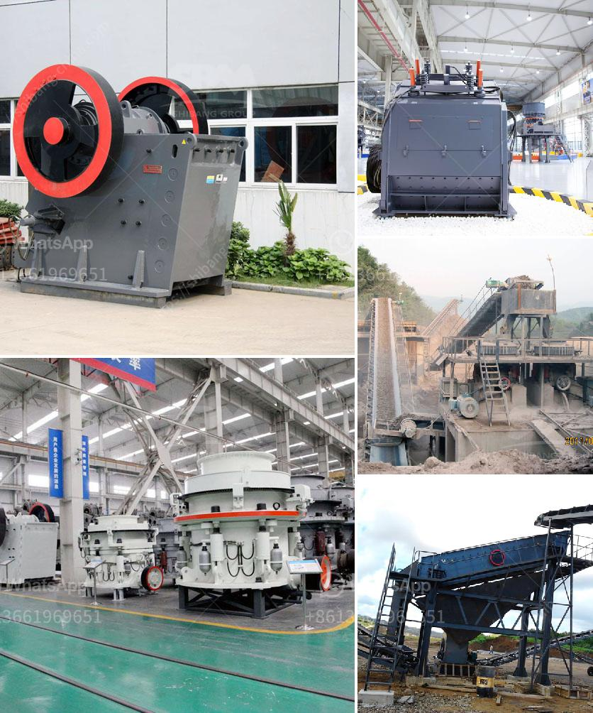

<h3>crusher dealers in cebu</h3>
Crushers are essential pieces of machinery for construction and mining activities. These heavy-duty equipment are designed to break large stones and rocks into smaller pieces, making them easier to transport and use for various purposes. In Cebu, an island province in the Philippines known for its rich natural resources, crusher dealers play a crucial role in providing the necessary equipment for these industries.

Cebu is a bustling province that thrives on its construction and mining sectors. The demand for crushers and other heavy equipment is continuously growing due to the increase in infrastructure projects and the expansion of mining operations. This has led to the rise of crusher dealers in Cebu who offer an extensive range of crushers and related equipment to cater to the diverse needs of local businesses.

One of the prominent crusher dealers in Cebu is Multico Prime Power Inc. This company has been serving the construction and mining industries for several decades. They offer a wide selection of crushers from well-known brands like Komatsu, Metso, and Kawasaki. Multico Prime Power Inc. prides itself on providing high-quality equipment that meets international standards.

Another reputable crusher dealer in Cebu is GTECo, which stands for General Trading and Equipment Company. GTECo has been in the industry for over 45 years, providing reliable heavy equipment for construction, mining, and industrial purposes. They offer a range of crushers, including jaw crushers, cone crushers, and impact crushers, all designed to withstand the rigors of demanding applications.

Apart from these established dealers, there are also smaller, independent crusher dealers in Cebu. These dealers often specialize in specific brands or types of crushers, giving customers more choices tailored to their specific needs. They may offer competitive prices and personalized service, particularly for businesses with unique requirements.

When choosing a crusher dealer in Cebu, there are several factors to consider. Firstly, the dealer should have a good reputation in the industry, with a track record of providing reliable equipment and excellent customer service. It is also important to look for dealers who offer comprehensive after-sales support, including maintenance services, spare parts availability, and technical assistance.

Price is another crucial factor to consider. While it is essential to find a dealer that offers competitive prices, it is equally important to prioritize quality and durability. Investing in a high-quality crusher may have a higher upfront cost, but it can ultimately save money in the long run by reducing maintenance and replacement expenses.

Furthermore, it is advisable to choose a dealer that offers a wide range of crushers and related equipment. This ensures that businesses have access to the right machine for their specific applications. Additionally, having a diverse selection allows businesses to compare different options and make informed decisions that suit their needs and budget.

In conclusion, crusher dealers in Cebu play a vital role in supporting the construction and mining industries in the province. With their extensive range of crushers and related equipment, they provide businesses with the necessary machinery to break down large stones and rocks efficiently. When selecting a crusher dealer, businesses should consider factors such as reputation, after-sales support, price, and equipment selection to ensure they receive the best value for their investment.
<h3>Contact us</h3><ul><li><strong>Whatsapp:&nbsp;<a href="https://wa.me/8613661969651">+8613661969651</a></strong></li><li><a href="https://swt.shibang-china.com/?git&amp;zhl&amp;crusher dealers in cebu"><strong>Online Service(chat now)</strong></a></li></ul><h3>Related</h3><ul><li><a href='gold mining equipment south africa.md'>gold mining equipment south africa</a></li><li><a href='limestone grinding and crushing.md'>limestone grinding and crushing</a></li><li><a href='marble crusher manufacturer.md'>marble crusher manufacturer</a></li><li><a href='small rock crusher mining.md'>small rock crusher mining</a></li><li><a href='crusher plant dengan kapasitas 100 ton h.md'>crusher plant dengan kapasitas 100 ton h</a></li></ul>