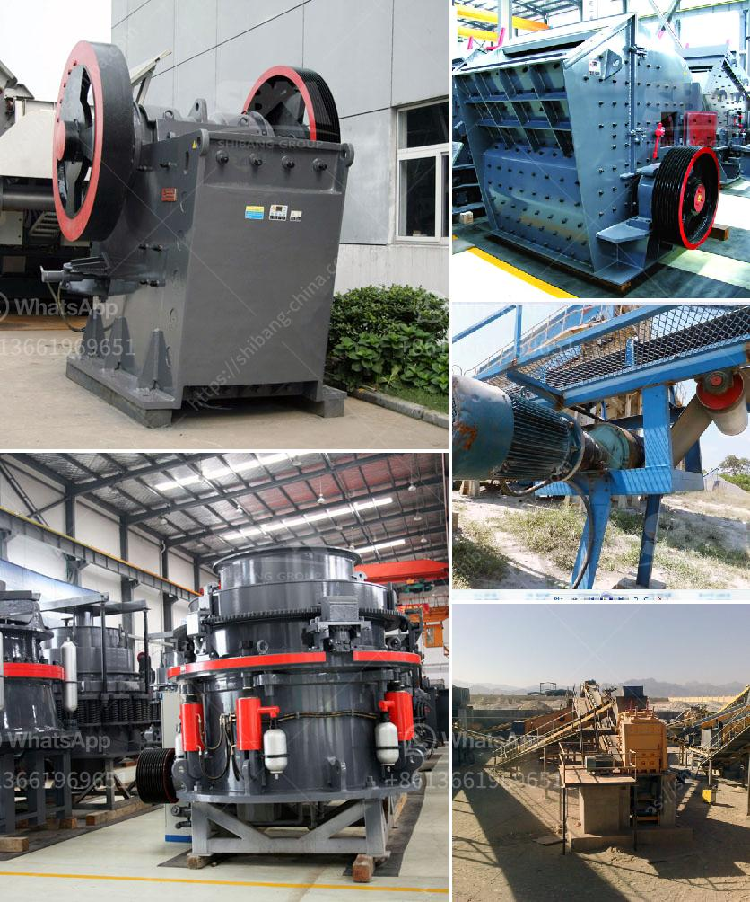

<h3>crusher for rent in malaysia</h3>
Crusher machines are equipment used to reduce the size of various materials such as rocks, ores, and minerals. Crushing is an essential step in a wide range of industries, including mining, construction, recycling, and more. Crusher for rent in Malaysia helps you to achieve high productivity without the stress and hassle of purchasing equipment.

The benefits of renting a crusher in Malaysia are immense. You save costs by not having to purchase a machine outright. Moreover, renting allows you to access the latest models with advanced features and technology. This ensures efficient and effective crushing operations that maximize productivity. Additionally, rentals often come with maintenance and servicing support, saving you from additional concerns and expenses.

One of the key advantages of crusher machines for rent in Malaysia is their versatility. They can be used in various applications, such as pre-crushing, secondary crushing, and tertiary crushing. It allows companies to process different types of materials, ranging from soft to hard rocks, from limestone to granite, from ore to coal. This flexibility ensures that the equipment remains useful across different projects and industries.

By opting for crusher rental services in Malaysia, businesses can benefit from increased flexibility, reduced costs, and improved operational efficiency. Renting a crusher also provides the advantage of having spare parts and expert technicians available on-site, which ensures minimal downtime in case of any mechanical issues. Furthermore, it allows companies to focus on their core operations while leaving the maintenance and repair to professionals.

In conclusion, crusher rental services in Malaysia provide numerous benefits for businesses across various industries. Renting allows companies to access advanced equipment, reduce costs, and enjoy the flexibility of using different models for different applications. With the support of maintenance and servicing, rental crushers ensure efficient and hassle-free operations. So, if you are looking to meet your crushing needs without the commitment of buying, consider crusher for rent in Malaysia as a viable option.
<h3>Contact us</h3><ul><li><strong>Whatsapp:&nbsp;<a href="https://wa.me/8613661969651">+8613661969651</a></strong></li><li><a href="https://swt.shibang-china.com/?git&amp;zhl&amp;crusher for rent in malaysia"><strong>Online Service(chat now)</strong></a></li></ul><h3>Related</h3><ul><li><a href='mining equipment seller in asia.md'>mining equipment seller in asia</a></li><li><a href='gold ore milling machine.md'>gold ore milling machine</a></li><li><a href='small slag crushing plant manufacturers in delhi.md'>small slag crushing plant manufacturers in delhi</a></li><li><a href='china crusher contact australia.md'>china crusher contact australia</a></li><li><a href='100tph coal crushing process.md'>100tph coal crushing process</a></li></ul>