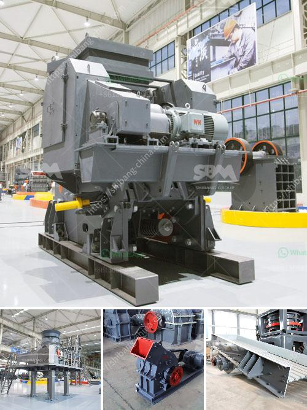

<h3>crusher for road base blue metal</h3>
When it comes to building roads or any other infrastructure projects, one of the most crucial aspects is the selection of the right materials for construction. Among the various materials used for road base construction, blue metal stands out as an excellent choice due to its durability, strength, and versatility. To efficiently produce the required amount of blue metal and obtain consistent quality, a crusher for road base blue metal becomes an essential tool. In this article, we will explore the significance of crushers for road base blue metal and highlight its benefits.

Blue metal, also known as crushed rock or quarry rock, is a crushed material commonly used as the base layer for constructing roads, driveways, and other similar projects. It is a strong and durable material that can withstand heavy loads and resist wear and tear over time. Blue metal derives its name from the bluish-gray color it possesses, which adds to its visual appeal when used in landscaping or decorative applications. This versatile material comes in various sizes, ranging from coarse rocks to finer granules, depending on the specific requirements of the project.

To meet the demand for blue metal in road construction, a crusher specifically designed for processing and manufacturing road base becomes indispensable. A crusher for road base blue metal is a heavy-duty machine that utilizes the mechanism of compression to break down large rocks into smaller pieces suitable for construction purposes. This crushing process involves feeding the blue metal rocks into the crusher's chamber, where a motor-driven rotor applies force to the material, causing it to break down and become crushed rock.

One of the significant advantages of using a crusher for road base blue metal is the ability to control the size and quality of the crushed material. By adjusting the crusher settings, operators can produce blue metal with specific size distributions, ensuring uniformity and consistency in the final product. This flexibility allows for customization, meeting the requirements of different road construction projects with precision.

Furthermore, a crusher for road base blue metal offers cost-efficiency and time-saving benefits. Instead of relying on naturally occurring blue metal deposits, which might not always be available in the required quantity, crushing machinery allows for on-site production. This eliminates the need for transportation and reduces dependency on external suppliers, resulting in substantial cost savings.

In addition, crushers for road base blue metal also contribute to environmental sustainability. By recycling construction waste, such as demolished concrete, these machines reduce the demand for natural resources and minimize the environmental impact associated with extractive industries. The use of recycled blue metal not only promotes eco-friendly practices but also ensures the responsible management of waste materials generated during construction.

In conclusion, selecting the right materials for road base construction is essential for ensuring the longevity and durability of infrastructure projects. Blue metal is an ideal choice due to its strength and versatility. To efficiently produce blue metal for road construction, a crusher designed specifically for crushing and manufacturing road base becomes indispensable. This powerful machine allows for precise control over the size and quality of crushed materials, offers cost-efficiency, saves time, and contributes to environmental sustainability. To achieve a sturdy foundation for any road or infrastructure project, a crusher for road base blue metal is the perfect solution.
<h3>Contact us</h3><ul><li><strong>Whatsapp:&nbsp;<a href="https://wa.me/8613661969651">+8613661969651</a></strong></li><li><a href="https://swt.shibang-china.com/?git&amp;zhl&amp;crusher for road base blue metal"><strong>Online Service(chat now)</strong></a></li></ul><h3>Related</h3><ul><li><a href='stone quarrying machines in dubai.md'>stone quarrying machines in dubai</a></li><li><a href='impact crusher ld pfw.md'>impact crusher ld pfw</a></li><li><a href='stone crushing machines for brick making.md'>stone crushing machines for brick making</a></li><li><a href='stone crusher price in india.md'>stone crusher price in india</a></li><li><a href='crusher business for sale in oman.md'>crusher business for sale in oman</a></li></ul>