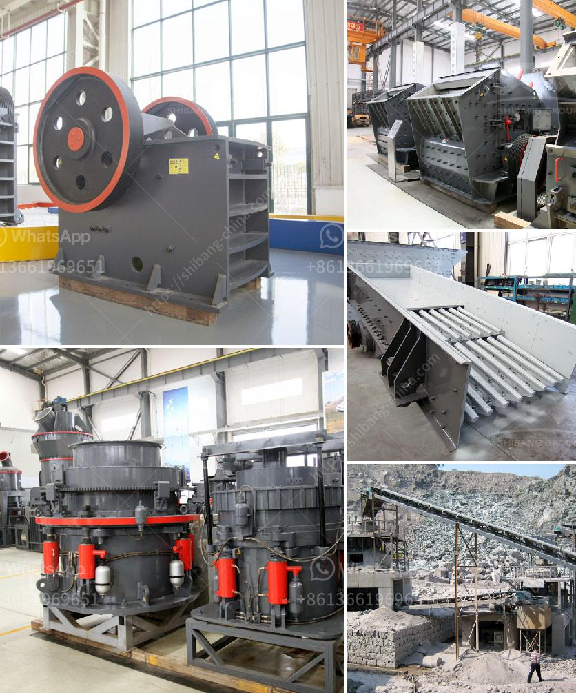

<h3>crusher for rocks machine for sale in uae</h3>
The UAE, a region known for its booming construction sector, is witnessing a high demand for quality rock crushers. This equipment is essential for crushing large rocks into smaller, more manageable sizes, which are then used for various construction purposes. With the growing need for infrastructure development, the market for crusher machines is expanding rapidly in the UAE.

A crusher for rocks machine serves as a vital tool in the construction industry because it enables efficient and cost-effective processing of materials. These machines are primarily used to break down rocks into smaller sizes, making it easier to transport and use them for construction projects such as road building, building foundations, and concrete production. Additionally, crushers also play a key role in the mining industry for extracting valuable minerals from rocks.

There are several types of crushers available in the market, each with its own unique features and advantages. Jaw crushers, cone crushers, and impact crushers are some of the commonly used options. These machines can handle different rock types, ranging from soft limestone to hard granite, with varying levels of hardness and abrasiveness.

Finding a high-quality crusher for rocks machine for sale in the UAE can be a challenging task. However, with thorough research and enquiry, potential buyers can find reputable suppliers and dealers who offer reliable and efficient machines. These suppliers often provide the necessary technical support and after-sales services to ensure the smooth functioning of the equipment.

Investing in a crusher for rocks machine in the UAE can be a wise decision for construction and mining companies. Having the ability to crush rocks on-site not only saves transportation costs but also reduces the environmental impact associated with transporting materials from quarries to construction sites. Moreover, with the growing demand for construction materials, owning a crusher can also be a profitable business opportunity.

In conclusion, the UAE's construction sector is flourishing, increasing the demand for crusher machines for rocks. Investing in a high-quality crusher not only benefits construction and mining companies but also contributes to sustainable development by reducing transportation costs and environmental impact. With the right research and support, finding a reliable crusher for rocks machine for sale in the UAE is feasible and can prove to be a fruitful investment.
<h3>Contact us</h3><ul><li><strong>Whatsapp:&nbsp;<a href="https://wa.me/8613661969651">+8613661969651</a></strong></li><li><a href="https://swt.shibang-china.com/?git&amp;zhl&amp;crusher for rocks machine for sale in uae"><strong>Online Service(chat now)</strong></a></li></ul><h3>Related</h3><ul><li><a href='hydraulic impact crusher.md'>hydraulic impact crusher</a></li><li><a href='gold mining equipment companies in china.md'>gold mining equipment companies in china</a></li><li><a href='price of mobile crusher in the philippines.md'>price of mobile crusher in the philippines</a></li><li><a href='iron ore mobile crusher available in india.md'>iron ore mobile crusher available in india</a></li><li><a href='sand making plant.md'>sand making plant</a></li></ul>