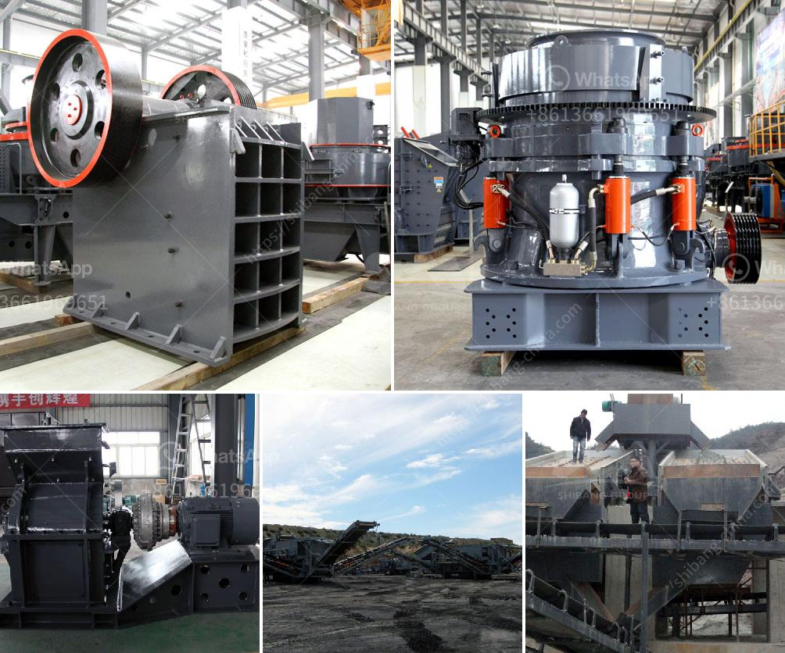

<h3>crusher for sale egypt</h3>
Egypt has been experiencing a rapid growth in its construction industry, and with it comes the increasing demand for crushing equipment. A crusher is an indispensable piece of machinery for the construction industry as it helps to reduce the size of large rocks and stones, making them suitable for various construction purposes.

Crushers are widely used in quarry sites, mining, and recycling plants. They come in different sizes and types, including jaw crushers, cone crushers, and impact crushers. Each type of crusher is designed to cater to specific crushing needs, providing different levels of output and efficiency.

With the increasing demand for crushers in Egypt, it is no surprise that there are numerous crusher for sale Egypt options available in the market. This presents a great opportunity for construction companies and individuals looking to expand their operations or embark on new projects.

Investing in a crusher can provide numerous benefits for businesses in the construction industry. Not only can it help to improve productivity and efficiency, but it can also reduce operational costs by eliminating the need for manual labor in crushing rocks and stones. Additionally, having a crusher on-site allows for a more efficient management of construction waste by recycling and reusing materials.

When considering crusher for sale options in Egypt, it is important to choose a reliable and reputable supplier. One should look for suppliers who offer a range of crushers suited to their specific needs, provide efficient after-sales support, and prioritize the quality and durability of their products.

It is also essential to consider factors such as the operating cost, energy consumption, and maintenance requirements of the chosen crusher. The right crusher should offer a good balance of performance and cost-effectiveness.

With the right crusher for sale Egypt, construction companies and individuals can unlock the potential of Egypt's booming construction industry. The investment in a crusher can prove to be a wise choice, ensuring a competitive edge for businesses and contributing to the development of Egypt's infrastructure.
<h3>Contact us</h3><ul><li><strong>Whatsapp:&nbsp;<a href="https://wa.me/8613661969651">+8613661969651</a></strong></li><li><a href="https://swt.shibang-china.com/?git&amp;zhl&amp;crusher for sale egypt"><strong>Online Service(chat now)</strong></a></li></ul><h3>Related</h3><ul><li><a href='coconut shell powder making machine grinding mill for sale.md'>coconut shell powder making machine grinding mill for sale</a></li><li><a href='stone crushers in south africa.md'>stone crushers in south africa</a></li><li><a href='rock quarry equipment for sale.md'>rock quarry equipment for sale</a></li><li><a href='concrete crushing machines in kenya.md'>concrete crushing machines in kenya</a></li><li><a href='small scale iron ore processing plants sale.md'>small scale iron ore processing plants sale</a></li></ul>