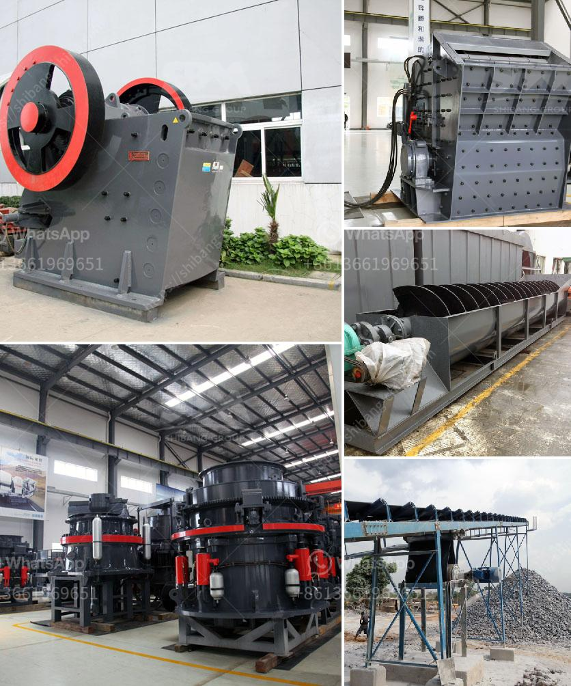

<h3>crusher for sale in malaysia</h3>
When it comes to large-scale construction projects, it is undeniable that the process of crushing concrete and other materials is critical. In Malaysia, like many other countries, there is a considerable abundance of raw materials that need to be crushed and utilized in various construction projects. To cater to this growing demand, there are numerous crushers for sale in Malaysia, making it increasingly easy for businesses to obtain these essential pieces of equipment.

A crusher plays a crucial role in the process of creating and recycling materials for various construction projects. It empowers contractors to break down large blocks of concrete waste into manageable sizes and recycle them for further use. This significantly reduces the need for transporting and disposing of waste materials, thereby minimizing the impact on the environment. Additionally, crushers also play a vital role in producing aggregates and other materials needed in the construction of roads, buildings, and infrastructure.

One of the options available for purchasing crushers in Malaysia is via online marketplaces. With the advancement of technology, many online platforms have emerged, providing a wide range of crusher options for businesses to choose from. These platforms offer detailed information about each crusher, including its specifications, capacity, and price, enabling businesses to make informed decisions. Moreover, online marketplaces often provide delivery options, making it convenient for businesses to receive the equipment at their desired location.

Aside from online marketplaces, there are also physical stores and distributors that offer crushers for sale. These brick-and-mortar establishments often have showrooms where potential buyers can inspect the equipment in person and seek guidance from knowledgeable sales personnel. This allows businesses to have a more hands-on experience with the crushers, ensuring that they are making the right investment. Furthermore, physical stores may offer additional services such as installation and maintenance support, which can be valuable to businesses in the long run.

When considering purchasing a crusher in Malaysia, there are several factors businesses should take into account. First and foremost, they should assess their specific needs and choose a crusher that is suitable for their operations. This includes considering the type of materials they will be crushing, the required capacity, and the desired output size. Additionally, businesses should also consider the reliability and durability of the crusher, as well as the availability of spare parts and after-sales support.

Lastly, businesses should also factor in their budget when looking for crushers for sale in Malaysia. The prices of crushers can vary greatly depending on their specifications, capacity, and brand. It is crucial for businesses to set a budget and consider their return on investment when selecting a crusher. While it may be tempting to opt for a cheaper option, it is essential to focus on the long-term benefits and efficiency that a reliable crusher can bring to the business.

In conclusion, crushers play a pivotal role in the construction industry in Malaysia. With the abundance of raw materials, the demand for crushers has grown significantly in recent years. Businesses can choose from various options available, including online marketplaces and physical stores. By considering their specific needs, reliability, and budget, businesses can find the perfect crusher to enhance their operations and contribute to a more sustainable future.
<h3>Contact us</h3><ul><li><strong>Whatsapp:&nbsp;<a href="https://wa.me/8613661969651">+8613661969651</a></strong></li><li><a href="https://swt.shibang-china.com/?git&amp;zhl&amp;crusher for sale in malaysia"><strong>Online Service(chat now)</strong></a></li></ul><h3>Related</h3><ul><li><a href='sell stone crusher.md'>sell stone crusher</a></li><li><a href='germany stone crusher.md'>germany stone crusher</a></li><li><a href='mobile stone crusher plant on hire in india.md'>mobile stone crusher plant on hire in india</a></li><li><a href='small scale verticle grinding limestone machine.md'>small scale verticle grinding limestone machine</a></li><li><a href='carbon black grinding.md'>carbon black grinding</a></li></ul>