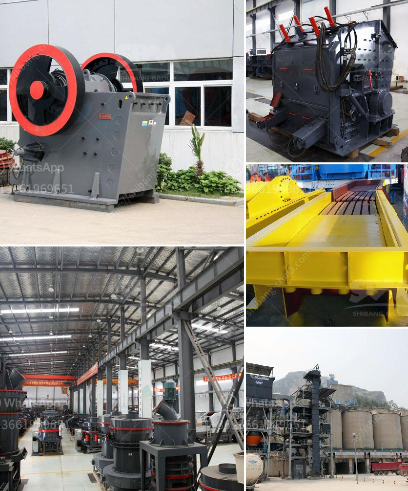

<h3>crusher gravel crusher gravel crusher price</h3>
When it comes to construction projects, road building, landscaping, and various other industries, gravel is an essential material. It not only provides stability to structures under heavy loads but also enhances aesthetic appeal to outdoor spaces. Crusher gravel is specifically designed for these purposes, providing a durable and cost-effective solution.

Crusher gravel is a type of compacted stone that is crushed and graded to specific sizes. Its angular shape and rough texture make it the perfect choice for creating a strong foundation for driveways, pathways, and patios. This compacted material also acts as a natural filter, ensuring proper drainage and preventing erosion.

One of the significant advantages of using crusher gravel is its affordability. Compared to other materials like concrete or asphalt, gravel is considerably cheaper. This cost-effectiveness makes it a popular choice among homeowners, contractors, and businesses working within budget constraints. Additionally, several factors contribute to the affordability of crusher gravel, including availability, production process, and transportation costs.

Availability plays a vital role in determining the price of crusher gravel. Different regions have varying supplies of gravel, depending on the geological composition of the area. Areas with an abundant supply of gravel tend to offer it at a lower cost since transportation expenses are reduced. On the other hand, areas with limited gravel deposits might have higher prices due to the cost of importing it from distant locations.

The production process also affects the price of crusher gravel. Different methods, such as sourcing raw materials from quarries, crushing and screening processes, and even grading, can influence the overall cost. Efficient production techniques and economies of scale can contribute to lower prices.

Transportation costs are another factor impacting the price of crusher gravel. The distance between the gravel source and the project site can significantly affect pricing. Gravel sourced from nearby quarries will often be cheaper compared to sourcing it from distant locations. These transportation costs include fuel expenses, truck maintenance, labor, and any tolls or fees along the route.

It's important to consider the quality and durability of crusher gravel when comparing prices. Cheaper alternatives may not offer the same level of performance and longevity. Understanding the specifications and grading of gravel will help ensure that you make an informed purchasing decision. 

Another aspect to keep in mind is that prices may vary depending on the quantity of crusher gravel required. Bulk orders have the advantage of economies of scale and may be subject to discounts. It's advisable to reach out to local suppliers and inquire about bulk prices to get the best value for money.

In conclusion, crusher gravel is a budget-friendly and versatile material that offers a multitude of applications in various industries. Its affordability is attributed to factors such as availability, production methods, and transportation costs. However, it's crucial to prioritize quality and durability when comparing prices. By considering these factors, potential buyers can make an informed decision and ensure a successful project within their budget.
<h3>Contact us</h3><ul><li><strong>Whatsapp:&nbsp;<a href="https://wa.me/8613661969651">+8613661969651</a></strong></li><li><a href="https://swt.shibang-china.com/?git&amp;zhl&amp;crusher gravel crusher gravel crusher price"><strong>Online Service(chat now)</strong></a></li></ul><h3>Related</h3><ul><li><a href='gypsum processing machine suppliers.md'>gypsum processing machine suppliers</a></li><li><a href='raymond mill manufactrer in udaipur.md'>raymond mill manufactrer in udaipur</a></li><li><a href='mtw grinding mill.md'>mtw grinding mill</a></li><li><a href='gravel conveyors and scales for sale.md'>gravel conveyors and scales for sale</a></li><li><a href='mtw series trapezium mill.md'>mtw series trapezium mill</a></li></ul>