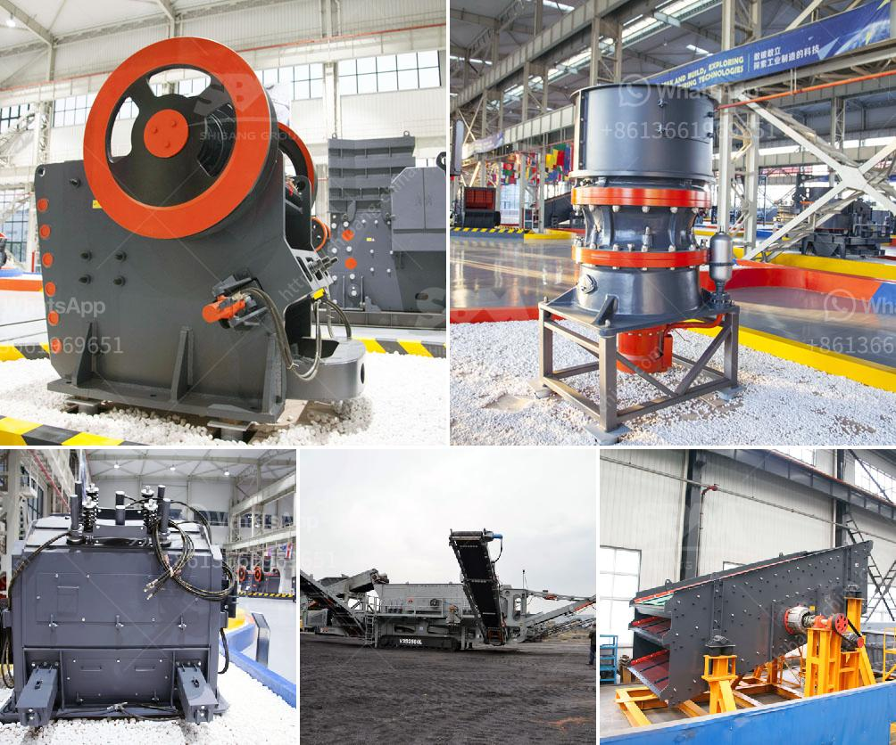

<h3>crusher impact germany</h3>
Germany has always been at the forefront of technological advancements across various industries, and the crushing industry is no exception. The country is known for its engineering prowess and innovative spirit, constantly pushing boundaries and offering cutting-edge solutions. One prime example of this is the crusher impact technology developed in Germany.

Crusher impact technology refers to a revolutionary way of crushing materials, where a high-speed rotor is utilized to strike the incoming feed material, shattering it into smaller pieces. This technology has proved to be highly efficient, providing a significant improvement in the overall crushing process.

The crusher impact Germany technology has evolved over the years, with continuous research and development, resulting in enhanced performance and increased reliability. Manufacturers in Germany have been constantly refining their designs to deliver higher throughput rates, improved particle shape, and reduced operational costs.

One of the key advantages of crusher impact Germany technology is its ability to handle a wide range of materials. Whether it's hard and abrasive rocks, concrete, or asphalt, this technology can effectively break down the materials into desired sizes. This versatility makes it suitable for various applications, including construction, mining, and recycling.

The crusher impact Germany technology offers several benefits over traditional crushers. Firstly, it ensures a higher reduction ratio, meaning smaller-sized particles can be obtained with minimal waste. This is particularly advantageous in the construction industry, where specific size requirements are crucial for different applications.

Additionally, crusher impact Germany technology provides excellent particle shape control. The high-speed rotor creates a more cubical shape, resulting in better product quality. This is especially important in the production of aggregates, where the shape of the particles affects the overall performance of the material in concrete and asphalt.

Furthermore, crusher impact Germany technology helps in reducing operational costs. The design improvements in rotor geometry and the use of advanced wear-resistant materials ensure longer wear life and reduced downtime. Additionally, the automated control systems in modern crushers allow for optimized performance, minimizing energy consumption and maximizing production efficiency.

Germany has become a global leader in crusher impact technology, with several renowned manufacturers catering to domestic and international markets. These manufacturers ensure high-quality products by adhering to strict production standards and incorporating the latest technological advancements in their crushers.

The impact of German crusher technology can be witnessed worldwide, where its adoption has transformed the crushing industry. It has optimized operations, enabling companies to produce high-quality products in a more cost-effective and sustainable manner. Whether it's road construction, mining operations, or recycling facilities, crusher impact Germany technology has made a significant impact, revolutionizing the way materials are crushed.

In conclusion, crusher impact Germany technology has proven to be a game-changer in the crushing industry. With its ability to handle various materials, achieve higher reduction ratios, and deliver superior particle shape control, it has become the preferred choice for many companies. Germany's commitment to innovation and engineering excellence is evident in the development and evolution of this technology. The impact of German crusher technology is felt worldwide, contributing to the advancement of various industries and setting new standards for crushing efficiency and effectiveness.
<h3>Contact us</h3><ul><li><strong>Whatsapp:&nbsp;<a href="https://wa.me/8613661969651">+8613661969651</a></strong></li><li><a href="https://swt.shibang-china.com/?git&amp;zhl&amp;crusher impact germany"><strong>Online Service(chat now)</strong></a></li></ul><h3>Related</h3><ul><li><a href='mtw series trapezium mill.md'>mtw series trapezium mill</a></li><li><a href='hammer mill in china.md'>hammer mill in china</a></li><li><a href='coal crusher design calculation.md'>coal crusher design calculation</a></li><li><a href='types of crusher for ore processing.md'>types of crusher for ore processing</a></li><li><a href='crusher and wash plant for sale in china.md'>crusher and wash plant for sale in china</a></li></ul>