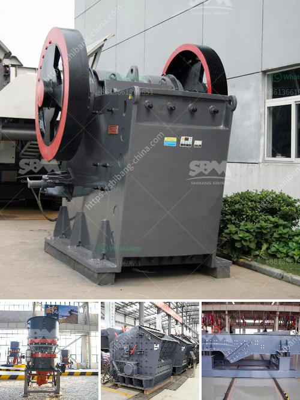

<h3>crusher in argentina stone crusher</h3>
Argentina, officially known as the Argentine Republic, is a country located in South America. Renowned for its diverse landscapes and rich cultural heritage, Argentina is also home to a variety of natural resources, including oil, minerals, and precious stones. One such valuable resource found in abundance is stone, and the stone crusher, used to extract, process, and ultimately create usable construction materials.

The stone crusher is a machine used to crush rocks into smaller pieces, usually for gravel or some other road or building application. Most stone crushers have a hopper at the top, a container which holds the rock above the crusher and uses gravity to feed it in. As the rock falls into the crusher, it is hit by metal blades called hammers, striking the material and breaking it apart.

In Argentina, stone crushers have a long history. As early as the 19th century, in the countryside, crushers were used to crush stones for road construction. Farmers and peasants would use these crushers to enhance their fields and make transportation easier. Over time, the machines evolved, becoming more efficient and powerful.

Today, stone crushers in Argentina can be found in various regions, including Córdoba, San Juan, and Mendoza. These machines are not only essential for road construction but also play a vital role in the mining industry. In quarries, the stone crusher is used to process large rocks into smaller stones that can be used for construction purposes or to create gravel for landscaping and concrete production.

The stone crusher industry in Argentina has seen significant growth in recent years. This is due to the increasing demand for construction materials, mainly driven by infrastructure projects and urbanization. Argentina's government has been investing heavily in infrastructure development, leading to a surge in construction activities and the need for stone crushers.

One notable company in the stone crusher industry in Argentina is Crusher. With over 15 years of experience, Crusher specializes in transforming waste into valuable materials, such as sand, stone, and gravel. Their innovative approach, coupled with their commitment to sustainability, has made them leaders in the industry.

Additionally, the stone crusher industry in Argentina has also seen the emergence of small-scale independent contractors. These individuals operate smaller crushers, often on a mobile basis, offering their services to local communities. They play a crucial role in rural areas, providing construction materials and creating employment opportunities.

Despite the industry's growth, it is not without its challenges. Environmental concerns associated with stone crushers include noise pollution and dust emissions. To mitigate these issues, regulations have been implemented to ensure crushers comply with environmental standards.

In conclusion, the stone crusher industry in Argentina is an essential sector that supports infrastructure development and provides construction materials for various applications. As the demand for construction materials continues to rise, the stone crusher industry is expected to thrive. With ongoing technological advancements and a focus on sustainability, the industry is poised for further growth and development in the years to come.
<h3>Contact us</h3><ul><li><strong>Whatsapp:&nbsp;<a href="https://wa.me/8613661969651">+8613661969651</a></strong></li><li><a href="https://swt.shibang-china.com/?git&amp;zhl&amp;crusher in argentina stone crusher"><strong>Online Service(chat now)</strong></a></li></ul><h3>Related</h3><ul><li><a href='granite processing plant.md'>granite processing plant</a></li><li><a href='copper crusher plant for sale chile.md'>copper crusher plant for sale chile</a></li><li><a href='jaw crusher pe 250 x 400.md'>jaw crusher pe 250 x 400</a></li><li><a href='artificial stone production plant in turkey.md'>artificial stone production plant in turkey</a></li><li><a href='crusher in argentina stone crusher.md'>crusher in argentina stone crusher</a></li></ul>