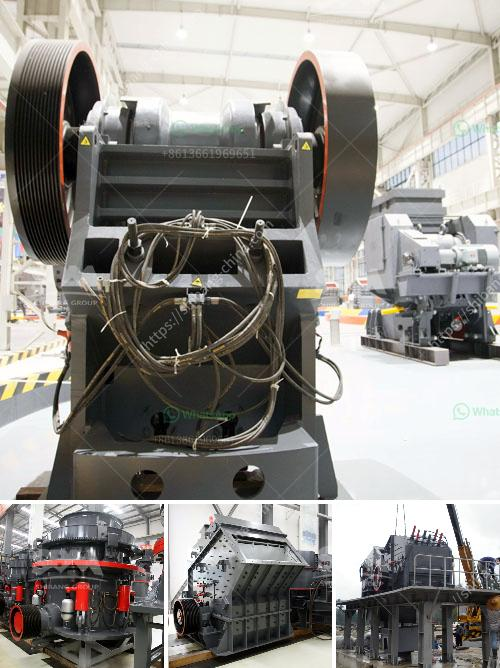

<h3>crusher in malaysia</h3>
Crusher machines are primarily used to crush rocks and ores, in order to extract valuable minerals and metal ores. However, crushers are also used in the recycling process of re-sold materials such as concrete, bricks, glass, and ceramics, as well as other similar materials. This robust machine is capable of reducing large rocks into smaller ones, resulting in a more manageable size for easier transport and handling.

In Malaysia, the use of crusher machines is prevalent in industries such as mining and construction. From the early stages, the mining industry relied on manual labor, which was inefficient and costly. As the demand for natural resources increased, crusher machines began to be introduced for the purpose of breaking rocks and ores effectively and efficiently.

The utilization of crushers in Malaysia started in the mid-1800s, when the country was colonized by the British. With the introduction of modernized equipment, the mining industry witnessed rapid economic growth. In Malaysia, the production of gold, iron ore and coal increases annually, which in turn drives the demand for the use of crushers.

It is estimated that the total value of minerals produced in Malaysia will reach 169.5 million Malaysian Ringgit in 2020. With the increasing importance of mining activities in the country, there is a growing demand for crusher machines.

As a leading supplier of crushers in Malaysia, we are confident to provide the best products and services for our customers. For years, our team has dedicatedly developed and improved our products to ensure they are of the highest quality and efficiency. We offer a wide range of crushers, including jaw crushers, cone crushers, and impact crushers.

Our crushers are designed to reduce large rocks into smaller rocks, gravel, or rock dust. They are equipped with a rotating shaft that rotates at a high speed with a crushing chamber that is built to withstand the pressure and wear caused by the production process.

To ensure optimal performance and prolong the lifespan of our crushers, regular maintenance is essential. Our team of technicians is always available to provide technical support and assistance, including troubleshooting and servicing.

Customers in Malaysia can rely on our extensive network of service providers, including authorized distributors and dealers, to ensure timely and efficient delivery of spare parts and consumables. We aim to minimize downtime and maximize productivity for our customers.

In conclusion, crusher machines are an essential tool in Malaysia's mining and construction industries. They contribute to the production of desirable products that are used as raw materials for other industries such as cement, ceramics, and mineral processing. Crushers have also become more affordable and are now accessible to small- and medium-sized businesses. We are confident that our crushers will provide reliable and efficient solutions to your crushing needs.
<h3>Contact us</h3><ul><li><strong>Whatsapp:&nbsp;<a href="https://wa.me/8613661969651">+8613661969651</a></strong></li><li><a href="https://swt.shibang-china.com/?git&amp;zhl&amp;crusher in malaysia"><strong>Online Service(chat now)</strong></a></li></ul><h3>Related</h3><ul><li><a href='second hand jaw crusher for sale in malaysia.md'>second hand jaw crusher for sale in malaysia</a></li><li><a href='quote for sand making machine.md'>quote for sand making machine</a></li><li><a href='hammer mill clay.md'>hammer mill clay</a></li><li><a href='mineral pulverizer to 300 micron.md'>mineral pulverizer to 300 micron</a></li><li><a href='used mobile quarry equipment.md'>used mobile quarry equipment</a></li></ul>