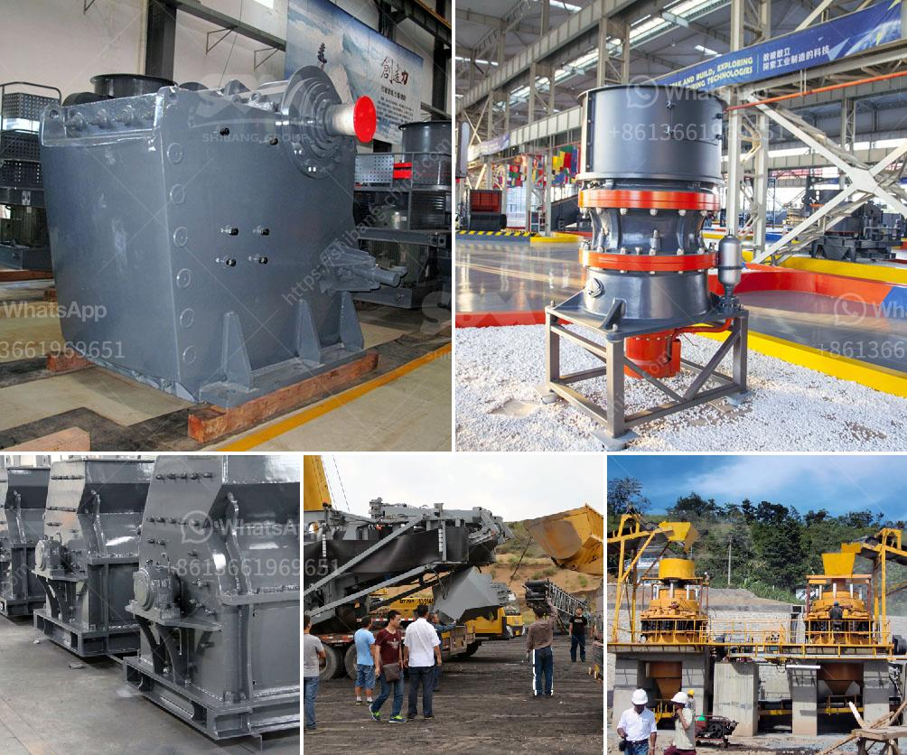

<h3>crusher machine crusher machine</h3>
In the construction industry, the importance of crusher machines is undeniable. These machines come in various types and have their own specific uses to cater to different construction needs. Understanding the various types of crusher machines will enable you to make the right choice for your project.

One of the crusher machine types available in the market is the jaw crusher. This machine is typically used for primary crushing of stones and rocks to medium or smaller size. The jaw crusher is known for its large crushing force and high efficiency capacity. It is designed to withstand the toughest materials, making it suitable for various construction projects.

Another type of crusher machine is the cone crusher. It is used for secondary or tertiary crushing of various materials such as gravel, coal, and ores. The cone crusher offers high crushing ratio and uniform product size. It operates by rotating the materials between an eccentrically gyrating cone and a fixed outer concave.

Impact crushers are another type of crusher machine commonly used in the construction industry. They are designed to crush materials through impact, producing a cubical-shaped product. Impact crushers are versatile and can be used in any stage of the crushing process. They are ideal for crushing materials with low to medium hardness.

When it comes to versatility, hammer crushers are at the top of the list. They are widely used for crushing brittle and medium-hard materials. The hammer crusher operates on the principle of impact crushing, where the material is hit by rapidly rotating hammers and crushed against a solid surface. Hammer crushers are commonly used in mining, building materials, and metallurgy industries.

There is a crusher machine available for every construction need, from primary to tertiary crushing. However, it is important to choose the right crusher machine that matches your specific requirements. Factors to consider include the material hardness, desired product size, production capacity, and equipment cost.

In recent years, the demand for crusher machines has increased significantly, especially with the development of the construction industry and infrastructure projects worldwide. The use of crusher machines has improved efficiency and productivity on construction sites, as it reduces the need for manual labor and manual crushing.

Crusher machines have revolutionized the construction industry by providing advanced technology and high-performance capabilities. They save both time and effort, allowing construction projects to be completed faster and more efficiently. Additionally, these machines have proven to be cost-effective and sustainable alternatives, contributing to reducing the environmental impact of construction activities.

In conclusion, crusher machines are essential equipment in the construction industry. They come in different types, each serving a specific purpose to cater to various construction needs. From jaw crushers to impact crushers, these machines offer high efficiency and productivity, making them indispensable on construction sites. Choosing the right crusher machine ensures optimal performance and cost-effectiveness, leading to successful construction projects. Embracing the advancements in crusher machine technology will undoubtedly elevate the construction industry to new heights.
<h3>Contact us</h3><ul><li><strong>Whatsapp:&nbsp;<a href="https://wa.me/8613661969651">+8613661969651</a></strong></li><li><a href="https://swt.shibang-china.com/?git&amp;zhl&amp;crusher machine crusher machine"><strong>Online Service(chat now)</strong></a></li></ul><h3>Related</h3><ul><li><a href='manufacturing process of plaster of paris china.md'>manufacturing process of plaster of paris china</a></li><li><a href='cement production equipment in germany.md'>cement production equipment in germany</a></li><li><a href='cement project cost in pakistan.md'>cement project cost in pakistan</a></li><li><a href='small scale aggregate crushing machine.md'>small scale aggregate crushing machine</a></li><li><a href='chrome crusher for sale south africa.md'>chrome crusher for sale south africa</a></li></ul>