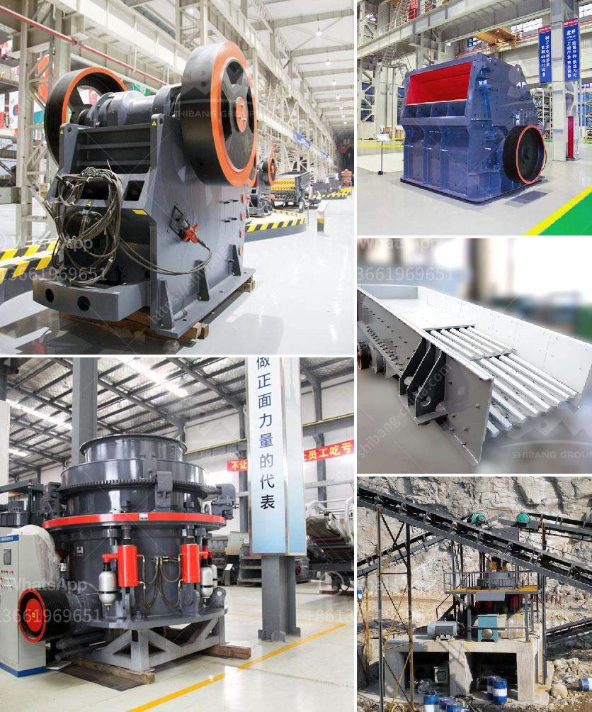

<h3>crusher machine factories in coimbatore</h3>
Coimbatore, often referred to as the "Manchester of South India," is famous for its textile industry. However, this bustling city is not just limited to textiles; it is also home to several crusher machine factories. These factories play a vital role in the manufacturing and production of crusher machines used in various industries.

Crusher machines are heavy-duty equipment designed to break large rocks into smaller-sized rocks, gravel, or dust. They are commonly used in the mining, construction, and recycling industries to reduce the size of materials for further processing. Coimbatore, with its skilled workforce and infrastructural support, has become a hub for crusher machine manufacturing.

One of the reasons why Coimbatore has emerged as a prominent center for crusher machine factories is the abundant availability of raw materials. The city is surrounded by granite quarries and hilly terrains, which provide ample resources for the crusher machine manufacturing process. This proximity to raw materials significantly reduces transportation costs and ensures a steady supply of materials.

Additionally, Coimbatore's well-developed industrial infrastructure has played a significant role in attracting crusher machine factories. The city boasts excellent connectivity by road, rail, and air, allowing easy transportation of machinery and finished products. Moreover, the city has a robust power supply and a skilled workforce, which are essential for efficient production.

The crusher machine factories in Coimbatore are known for their superior quality and adherence to international safety standards. The machines manufactured here are designed to withstand harsh conditions and deliver consistent performance. These factories use advanced technology and modern machinery to ensure precision and accuracy in every product they manufacture.

Moreover, the crusher machine factories in Coimbatore prioritize customer satisfaction by offering customized solutions. They understand that different industries have diverse requirements and tailor their machines accordingly. Whether it is a specific output size, material compatibility, or energy efficiency, these factories design and manufacture crushers to meet the exact needs of their clients.

Furthermore, these factories emphasize continuous research and development to stay at the forefront of technological advancements. They invest in state-of-the-art equipment and employ skilled engineers and technicians who are constantly striving for innovation. By incorporating the latest technologies into their products, these factories ensure that their crusher machines are efficient, durable, and eco-friendly.

Apart from manufacturing crusher machines, many factories in Coimbatore also provide comprehensive after-sales services. They offer installation support, regular maintenance, and timely spare parts replacement to ensure the smooth operation of their products. This commitment to after-sales service has earned them a reputation for reliability and has helped them establish long-lasting relationships with their customers.

In conclusion, the crusher machine factories in Coimbatore have contributed significantly to the industrial growth of the city. Their ability to produce high-quality machines, customized solutions, and excellent after-sales service has made them a preferred choice for industries across the globe. With Coimbatore's conducive business environment and skilled workforce, these factories are poised to further expand their operations and cement the city's position as a leading manufacturing hub in the crusher machine industry.
<h3>Contact us</h3><ul><li><strong>Whatsapp:&nbsp;<a href="https://wa.me/8613661969651">+8613661969651</a></strong></li><li><a href="https://swt.shibang-china.com/?git&amp;zhl&amp;crusher machine factories in coimbatore"><strong>Online Service(chat now)</strong></a></li></ul><h3>Related</h3><ul><li><a href='coal processing plants for sale.md'>coal processing plants for sale</a></li><li><a href='vertical grinder mill.md'>vertical grinder mill</a></li><li><a href='sand screeding machine prices.md'>sand screeding machine prices</a></li><li><a href='artificial stone production plant in turkey.md'>artificial stone production plant in turkey</a></li><li><a href='carbon black grinding.md'>carbon black grinding</a></li></ul>