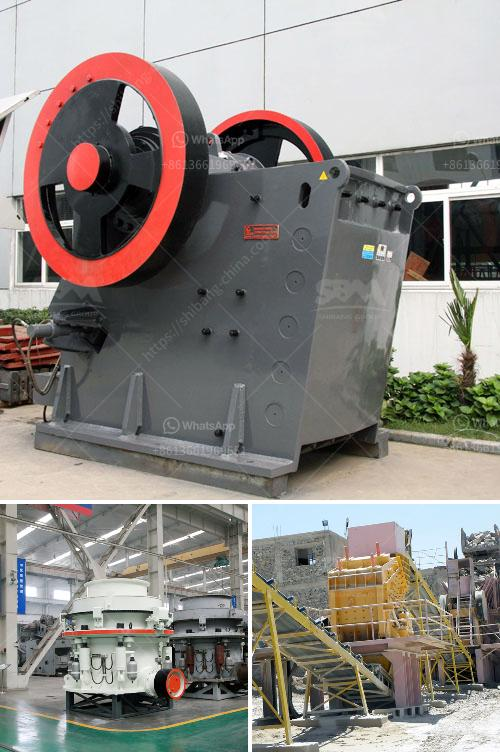

<h3>crusher machine for sale south africa</h3>
South Africa is rich in mineral resources, especially in recent years with the infrastructure construction ongoing, mining industry become the focus of investment. We all know that stone crusher plays an important role in the mining industry, so the rapid development of the industry, also contributed to the development of the stone crusher in South Africa.

The used stone crusher in South Africa mainly used in the ore mining beneficiation production lines or stone production line. Making the large stone break into a desired particle size metal smelting or engineering construction, to meet the needs of mineral processing and building products. There are many different types of stone crusher in South Africa, for example, pe jaw crusher, impact crusher,hammer crusher, hp cone crusher, cone crusher, vsi crusher and so on. Among them, the jaw crusher is the most common equipment. Why does the jaw crusher so popular in South Africain? Jaw crusher is the primary crushing equipment, but also the first choice for primary crushing equipment, but also a highly efficient, energy-saving crushing equipment. The jaw crusher equipment is mainly used for a variety of ores and medium-grained bulk materials crushing, crushing compression strength is not more than 320Mpa available materials. So what are the advantages of the jaw crusher?

The South Africa Jaw Crusher is one of the commonly used equipments in the crushing production line and the sand making production line. Due to the higher crushing output, larger crushing ratio, simple operation and good wear resistance, it is possible to properly install the South Africa Jaw Crusher for the whole The production line has a great influence. South Africa Jaw Crusher working environment is bad, the work process there will be some wear and tear on the equipment, which mainly refers to the wear of the liner. So, it needs to check the replacement of the liner regularly to ensure the efficiency of the South Africa Jaw Crusher. In addition, the South Africa Jaw Crusher should be used with caution. When selecting and using the re-mining crusher to process the stone, due to the difference in hardness between different minerals, the wear is also different. Therefore, it is necessary to select the appropriate materials when selecting the South Africa Jaw Crusher, and the wear resistance of the South Africa Jaw Crusher should be considered in the selection.

In conclusion, controlling operating costs through efficient crushing and screening equipment is critical. That’s why we offer a full range of crushing and screening equipment designed to increase productivity and profitability. Our jaw crushers are built to perform the most difficult work in the toughest conditions, and we provide high-quality products and excellent after-sales service to all customers. If you are interested in our crusher machine for sale South Africa, please contact us immediately. We will provide you with high-quality products and excellent service.
<h3>Contact us</h3><ul><li><strong>Whatsapp:&nbsp;<a href="https://wa.me/8613661969651">+8613661969651</a></strong></li><li><a href="https://swt.shibang-china.com/?git&amp;zhl&amp;crusher machine for sale south africa"><strong>Online Service(chat now)</strong></a></li></ul><h3>Related</h3><ul><li><a href='lime grinding machine manufacturer in kolhapur.md'>lime grinding machine manufacturer in kolhapur</a></li><li><a href='marble powder plant price pakistan.md'>marble powder plant price pakistan</a></li><li><a href='crusher price china.md'>crusher price china</a></li><li><a href='stone crusher used for sale spain.md'>stone crusher used for sale spain</a></li><li><a href='micro fine grinding machine.md'>micro fine grinding machine</a></li></ul>