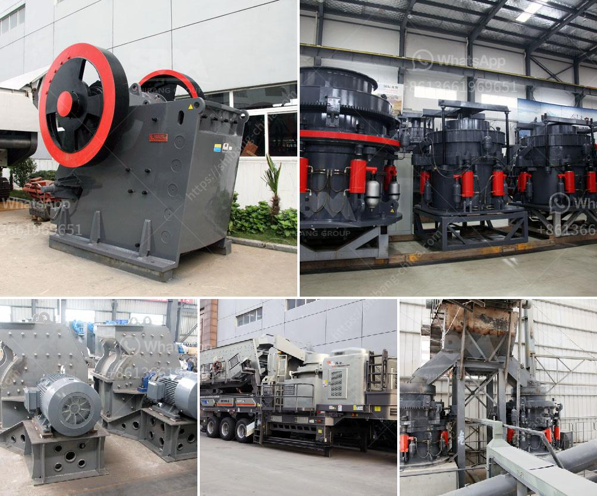

<h3>crusher machine in europe</h3>
Europe is rich in natural resources, which include aggregates, such as sand, gravel, and crushed rock. These resources play a vital role in the construction industry, as they are necessary ingredients in the production of concrete, asphalt, and other building materials. To obtain these essential materials, the European construction industry heavily relies on crusher machines.

Crusher machines are mechanical devices that are used to reduce the size of large objects into smaller ones. These machines are commonly seen in quarries, mining sites, and recycling facilities, where they are utilized to break down rocks, ore, and other hard materials into smaller particles. The primary function of a crusher machine is to produce a final product with a desired size and shape through a series of crushing and grinding processes.

In Europe, there are various types of crusher machines available, each with different capabilities and features. Europe is known for its leading machinery manufacturers, who continuously innovate and develop new crusher machines to meet the growing demands of the construction industry. Some of the most commonly used crusher machines in Europe include jaw crushers, cone crushers, impact crushers, and gyratory crushers.

Jaw crushers are one of the most popular crusher machines in Europe. These machines are primarily used for coarse crushing of various hard materials. The crushing chamber consists of two jaws, which exert pressure on the material being crushed. Jaw crushers are versatile machines that can be used in stationary and mobile applications, making them suitable for a wide range of industries.

Cone crushers are another widely used type of crusher machine in Europe. These machines are commonly used to crush medium and high hardness materials, such as granite, basalt, limestone, and iron ore. Cone crushers have a conical shape, with a mantle and a concave. The material is fed into the cone crusher through a vibrating feeder or a conveyor belt, and is crushed between the mantle and the concave.

Impact crushers are known for their high reduction ratios and efficient crushing capacity. These machines are particularly suitable for crushing soft and medium-hard materials, such as limestone, gypsum, and coal. Impact crushers operate by throwing the material against a hard surface, causing it to break and reduce in size. This type of crusher machine is commonly used in the recycling industry, as it can process demolition waste and produce reusable materials.

Gyratory crushers are often used in large-scale mining operations and heavy-duty industrial applications. These machines are designed to handle extremely large feed sizes, with the ability to process hundreds of tons of material per hour. Gyratory crushers have a conical-shaped head and a concave surface, which provides a larger crushing chamber compared to other crusher machines. This allows for the efficient crushing of large rocks and ores.

In conclusion, crusher machines are essential devices in the European construction industry, as they are used to extract aggregates from natural resources and recycle materials. With a variety of types and models available, European manufacturers continue to produce advanced crusher machines that meet the specific needs of different industries. The continuous development and innovation in crusher technology contribute to the sustainable growth of the construction industry in Europe.
<h3>Contact us</h3><ul><li><strong>Whatsapp:&nbsp;<a href="https://wa.me/8613661969651">+8613661969651</a></strong></li><li><a href="https://swt.shibang-china.com/?git&amp;zhl&amp;crusher machine in europe"><strong>Online Service(chat now)</strong></a></li></ul><h3>Related</h3><ul><li><a href='stone crushing plants in kenya.md'>stone crushing plants in kenya</a></li><li><a href='raymond mill price.md'>raymond mill price</a></li><li><a href='size reduction equipment ball mill in details.md'>size reduction equipment ball mill in details</a></li><li><a href='suoer fine mill grinder.md'>suoer fine mill grinder</a></li><li><a href='start up granite quarry crusher business.md'>start up granite quarry crusher business</a></li></ul>