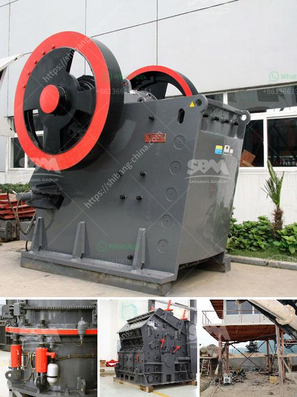

<h3>crusher machine manufacturers in india</h3>
Crusher machines are typically used in mining and construction industries to crush different types of materials into smaller size particles. They are designed to reduce the size of rocks, ores, and minerals into desired sizes for further processing. Today, crusher machines have become an essential part of many industrial sectors, especially in India where the demand for high-quality construction materials is booming.

India is one of the leading countries in terms of infrastructure development. The construction industry in India is witnessing a significant growth, which has created a huge demand for crusher machines. To meet this growing demand, many crusher machine manufacturers have established their presence in India. These manufacturers have a wide range of machines to cater to the diverse needs of the construction industry.

One of the prominent crusher machine manufacturers in India, is Shree Conmix Engineers Pvt. Ltd. They have been catering to the construction industry for more than two decades. The company offers a wide range of jaw crushers, cone crushers, vertical shaft impactors, and other crushing and screening plants. Their machines are known for their high performance, durability, and reliability.

Another renowned crusher machine manufacturer in India, is Propel Industries. Propel offers a wide range of advanced crushing and screening solutions for various industries such as mining, construction, and infrastructure. Their machines are known for their robust construction, excellent performance, and low maintenance requirements.

Apart from Shree Conmix Engineers Pvt. Ltd. and Propel Industries, there are several other crusher machine manufacturers in India, including Laxmi En-Fab Pvt Ltd, Nesans Mining and Automation Pvt. Ltd, and Rd Group. These manufacturers are known for their innovative approach, state-of-the-art technology, and customer-oriented solutions.

In conclusion, crusher machine manufacturers in India are witnessing a steady growth in demand for crushers in the construction industry. With the focus on infrastructure development and housing projects, the construction industry is on a positive growth trajectory. This has led to an increased demand for crusher machines, which has prompted manufacturers in India to expand their production facilities and cater to the growing needs of the market.
<h3>Contact us</h3><ul><li><strong>Whatsapp:&nbsp;<a href="https://wa.me/8613661969651">+8613661969651</a></strong></li><li><a href="https://swt.shibang-china.com/?git&amp;zhl&amp;crusher machine manufacturers in india"><strong>Online Service(chat now)</strong></a></li></ul><h3>Related</h3><ul><li><a href='vibrating screen price philippines.md'>vibrating screen price philippines</a></li><li><a href='ball mill machinery supplier manufacturer.md'>ball mill machinery supplier manufacturer</a></li><li><a href='marble crusher manufacturer.md'>marble crusher manufacturer</a></li><li><a href='stone crusher and quarry for sale in pakistan.md'>stone crusher and quarry for sale in pakistan</a></li><li><a href='quartz movement production process.md'>quartz movement production process</a></li></ul>