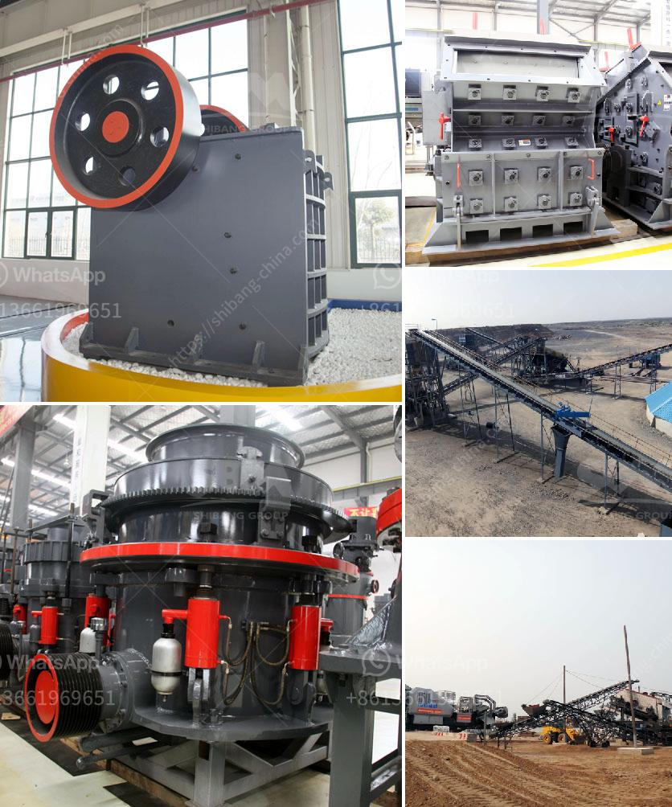

<h3>crusher machine manufacturers in pakistan</h3>
Crusher machines are used for crushing of stones, rocks, or ores into smaller pieces. They are used in construction, mining, and other industries. These machines come in a variety of sizes and types, including stationary and portable crushers. Manufacturers in Pakistan offer various types of crushers, such as jaw crushers, impact crushers, cone crushers, gyratory crushers, and hammer crushers.

Pakistan has a rich history of stone crushing, with traces back to the ancient times. The age-old techniques of stone crushing have evolved over the centuries. One of the famous places for stone crushing is Margalla Hills in Taxila. This region has rich limestone deposits and stone crushers are situated there. For decades, these stone crushers have been producing and supplying high-quality aggregates, contributing to the construction industry and infrastructure development in Pakistan.

With the advancement of technology, crusher machines have revolutionized the mining and construction industries. Advanced crusher machines can efficiently and effectively crush various types of stone and ores. They offer higher productivity, durability, and performance. These machines are equipped with advanced features, such as hydraulic control systems, automatic lubrication systems, adjustable settings, and digital control panels.

Many crusher machine manufacturers in Pakistan are engaged in producing high-quality crushing machines that are beneficial for the construction industry. They are producing crusher machines that are user-friendly, easy to use, and reliable. Crushing machines can be used to crush various stones, rocks, ores, and other hard materials. Different crushing machines are used for crushing different types of materials. The focus of manufacturers is to produce reliable, efficient, and cost-effective crushing equipment.

Pakistan crusher machine manufacturers are also offering a wide range of crushers and grinder machines in the market. These machines are used for crushing and grinding mineral or ore material. They are also used for separating impurities from ores or minerals. The crushing machines have gained huge success in recent years. Not only do they have many applications in the mining industry, but they are also used in construction, metallurgy, chemical, and other industries.

Crusher machines in Pakistan are divided into different types, such as jaw crushers, cone crushers, impact crushers, hammer crushers, and even more. Primarily, these machines are used to crush huge lumps of raw material into small pieces, so that they can later be used for further processing like making cement, sand, or smaller stones.

Due to the high demand for crusher machines, there are many crusher machine manufacturers in Pakistan who collaborate with overseas manufacturers for good quality products. The local manufacturers also offer competitive price tags for efficient and sustainable crushing machines. The crusher machine market is booming in Pakistan, with new crushers being added to the market frequently. Manufacturers have made sure that their machines are equipped with advanced features to meet the increasing needs of customers.

In conclusion, crusher machines are a vital part of the construction and mining industries in Pakistan. They are used to break down larger stones and rocks into smaller pieces for further processing. The demand for crusher machines is increasing, but so are the number of manufacturers offering their products. With advancements in technology, these machines are becoming more efficient, reliable, and durable, contributing to the growth of the construction industry in Pakistan.
<h3>Contact us</h3><ul><li><strong>Whatsapp:&nbsp;<a href="https://wa.me/8613661969651">+8613661969651</a></strong></li><li><a href="https://swt.shibang-china.com/?git&amp;zhl&amp;crusher machine manufacturers in pakistan"><strong>Online Service(chat now)</strong></a></li></ul><h3>Related</h3><ul><li><a href='jaw crusher for graphite.md'>jaw crusher for graphite</a></li><li><a href='kenya sand making machine.md'>kenya sand making machine</a></li><li><a href='to start small stone crusher plant.md'>to start small stone crusher plant</a></li><li><a href='nigeria inpactor crushers price.md'>nigeria inpactor crushers price</a></li><li><a href='manufacturer of barite in pakistan.md'>manufacturer of barite in pakistan</a></li></ul>