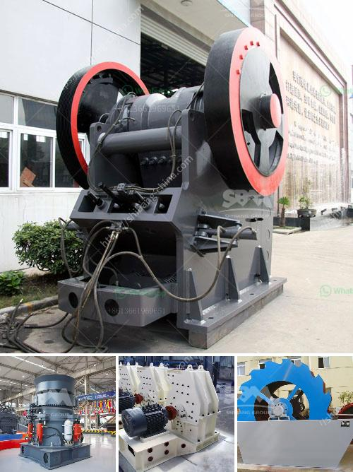

<h3>crusher machine on philippines pakistan</h3>
The Philippines and Pakistan are two countries located on two different continents, serving different purposes. However, they share one common challenge - the management of waste materials. The increasing population and industrialization in both countries have led to a significant rise in waste production, creating an urgent need for efficient waste management systems. Fortunately, one effective solution that both countries can employ is the use of crusher machines.

A crusher machine is a device that reduces waste materials into smaller, more manageable pieces. These machines are commonly used in waste management systems, recycling centers, and various industries for crushing purposes. They are efficient in breaking down different types of materials, including glass, concrete, metals, and plastic, among others.

In the Philippines, the rapid urbanization and population growth have resulted in an overwhelming volume of waste materials. According to the Ecological Solid Waste Management Act of 2000, around 35,000 tons of waste are generated daily in the country's capital city, Manila alone. This staggering amount creates a pressing need for effective waste management systems. Investing in crusher machines can be a game-changer in the country's waste management efforts.

Similarly, Pakistan is also facing a waste management crisis. With a population of over 220 million people, the waste generation rate in major cities has reached an alarming level. The inability of the existing waste management infrastructure to handle this enormous amount of waste has led to severe environmental consequences, endangering the health and well-being of citizens. Introducing crusher machines in Pakistan can significantly alleviate the waste management crisis by facilitating proper waste segregation and reducing the volume of waste that goes into landfills.

One key advantage of crusher machines is their versatility. These machines can be customized to meet specific requirements, making them suitable for a wide range of industries. In the Philippines and Pakistan, industries such as construction, mining, and manufacturing can greatly benefit from the use of crusher machines. By reducing the size of waste materials, these industries can effectively manage waste, save on transportation costs, and promote sustainability.

Another noteworthy benefit of crusher machines is their potential for recycling. In both the Philippines and Pakistan, recycling rates are relatively low. By investing in crusher machines, waste materials can be transformed into reusable resources. For instance, crushed concrete can be used as an aggregate in new construction projects, while crushed plastic can be used for manufacturing new plastic products. This not only reduces waste sent to landfills but also contributes to the circular economy.

However, there are a few challenges that need to be addressed when considering the integration of crusher machines in the waste management systems of the Philippines and Pakistan. Firstly, the initial investment cost of acquiring and installing these machines can be a hurdle, especially for municipalities or small businesses with limited budgets. Governments, private entities, and international organizations can play a crucial role in providing financial support and incentives to encourage the adoption of crusher machines.

Additionally, proper training and education of workers involved in waste management are essential for the safe and efficient operation of crusher machines. It is crucial to provide adequate training programs to ensure that operators are knowledgeable in handling and maintaining these machines, as well as adhering to safety protocols.

In conclusion, investing in crusher machines can revolutionize waste management in both the Philippines and Pakistan. These machines offer a versatile and effective solution for waste reduction, recycling, and promoting sustainable practices. While there may be challenges to overcome, the benefits for both countries are substantial. By incorporating crusher machines into their waste management systems, the Philippines and Pakistan can take significant strides towards a cleaner and more sustainable future.
<h3>Contact us</h3><ul><li><strong>Whatsapp:&nbsp;<a href="https://wa.me/8613661969651">+8613661969651</a></strong></li><li><a href="https://swt.shibang-china.com/?git&amp;zhl&amp;crusher machine on philippines pakistan"><strong>Online Service(chat now)</strong></a></li></ul><h3>Related</h3><ul><li><a href='used cement clinker grinding plant.md'>used cement clinker grinding plant</a></li><li><a href='stone crusher plant management.md'>stone crusher plant management</a></li><li><a href='impact crusher machine for sale.md'>impact crusher machine for sale</a></li><li><a href='china pasir harga washing plant.md'>china pasir harga washing plant</a></li><li><a href='business plan on quarry crusher.md'>business plan on quarry crusher</a></li></ul>