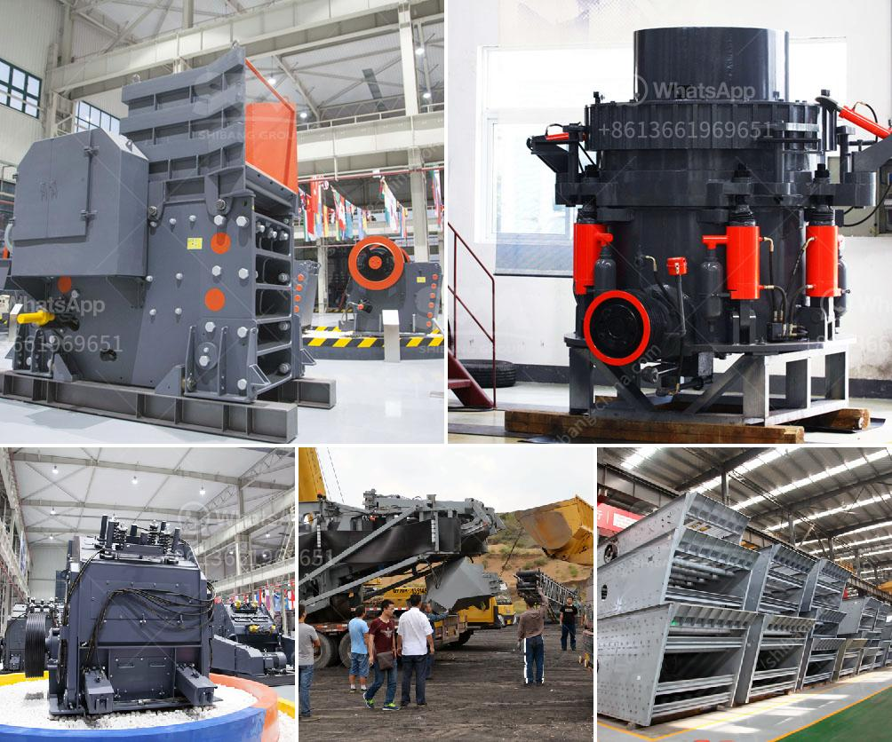

<h3>crusher machine sri lanka</h3>
Sri Lanka is a well-known country in South Asia, mainly for its breathtaking natural beauty, pristine beaches, and diverse wildlife. However, it is not only a popular tourist destination but also a prominent player in the construction industry, with its Crusher Machine manufacturing capabilities.

A crusher machine, also known as a stone crusher, is a necessary equipment in the mining and construction industry. It allows the crushing of several types of materials, such as rocks, ores, and stones, into smaller particles. This process makes it easier for further processing, like metal smelting or material shaping.

Sri Lanka boasts a booming construction industry, which has greatly contributed to the demand for crusher machines. The country's infrastructure development projects and rapid urbanization have accelerated the need for quality aggregate materials, which can be produced efficiently through the use of crusher machines.

One of the key manufacturers of these machines in Sri Lanka is XYZ Machinery. They specialize in designing and producing a wide range of crusher machines suitable for various applications. XYZ Machinery utilizes advanced technology and high-quality materials to ensure durability and optimum performance of their machines.

Their crusher machines come in different capacities and specifications, making it possible to cater to various customer requirements. Whether it's for small-scale construction projects or large-scale industrial operations, XYZ Machinery provides reliable and efficient solutions.

Furthermore, XYZ Machinery ensures their machines are user-friendly and easy to maintain. They strive to give customers a hassle-free experience with their products, as they understand the importance of a reliable and low-maintenance machine in the demanding construction industry.

In conclusion, Sri Lanka is a well-known destination for crusher machines. The country's construction industry continues to expand, driving the demand for high-quality materials, which can be efficiently produced with the help of crusher machines. XYZ Machinery, with its advanced technology and commitment to customer satisfaction, is a prominent player in supplying these machines to meet the needs of the Sri Lankan construction industry.
<h3>Contact us</h3><ul><li><strong>Whatsapp:&nbsp;<a href="https://wa.me/8613661969651">+8613661969651</a></strong></li><li><a href="https://swt.shibang-china.com/?git&amp;zhl&amp;crusher machine sri lanka"><strong>Online Service(chat now)</strong></a></li></ul><h3>Related</h3><ul><li><a href='granite crusher machine companies.md'>granite crusher machine companies</a></li><li><a href='aggregate grinding mill manufacturers in south philippines.md'>aggregate grinding mill manufacturers in south philippines</a></li><li><a href='jaw crusher routine service pdf.md'>jaw crusher routine service pdf</a></li><li><a href='limestone needed for 1 ton cement production.md'>limestone needed for 1 ton cement production</a></li><li><a href='cost of used crusher for granite.md'>cost of used crusher for granite</a></li></ul>