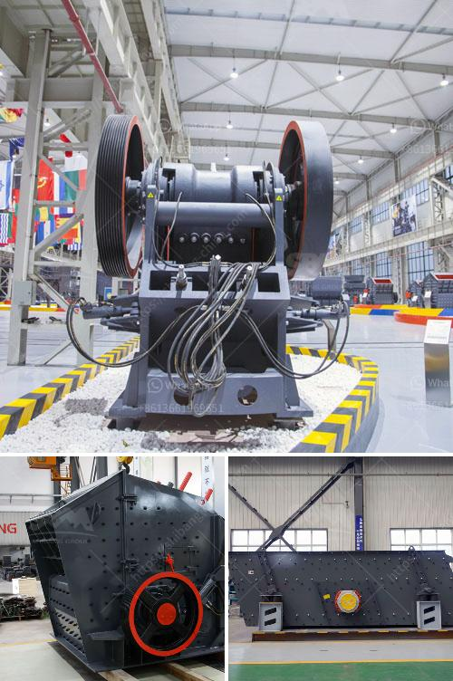

<h3>crusher machinery from china</h3>
China is a country known for its advanced technological capabilities and its vast machinery industry. In fact, China has now become the world's largest producer of machinery and equipment, surpassing Germany, the USA, and Japan. This growing presence in the machinery industry can be attributed to the numerous manufacturers based in China and the Chinese government's emphasis on promoting technological advancements.

One particular type of machinery that has seen significant growth in China is crusher machinery. Crushing equipment, such as impact crushers, jaw crushers, and cone crushers, has been developed to provide efficient and low-cost crushing solutions. These machinery are designed to crush tough materials, making them suitable for crushing hard rocks, ores, and minerals.

Chinese crusher machinery manufacturers began to develop their own crushers in the 1950s. Many of these crushers have become time-tested and iconic in the industry, such as the Shanghai Shibang Machinery's impact crusher, which is now widely used in various industries due to its excellent performance.

The competitive advantage of crusher machinery from China lies in its high-quality standards and low-cost manufacturing capabilities. Many Chinese manufacturers have adopted advanced production and quality control techniques to ensure the reliability and durability of their machinery. Furthermore, the lower labor costs in China ensure competitive pricing, making Chinese crusher machinery a cost-effective option for businesses worldwide.

Additionally, Chinese manufacturers have also focused on the development of sustainable and eco-friendly crusher machinery. They have employed advanced technologies to reduce energy consumption and emissions, thereby minimizing the impact on the environment. This commitment to sustainability has further enhanced the reputation of China's crusher machinery in the global market.

In conclusion, crusher machinery from China has gained a strong foothold in the global market due to its high-quality standards, low-cost manufacturing capabilities, and commitment to sustainability. With continuous advancements in technology and innovation, Chinese manufacturers are likely to maintain their leading position in the crusher machinery industry.
<h3>Contact us</h3><ul><li><strong>Whatsapp:&nbsp;<a href="https://wa.me/8613661969651">+8613661969651</a></strong></li><li><a href="https://swt.shibang-china.com/?git&amp;zhl&amp;crusher machinery from china"><strong>Online Service(chat now)</strong></a></li></ul><h3>Related</h3><ul><li><a href='mobile crusher on hire in tamil nadu.md'>mobile crusher on hire in tamil nadu</a></li><li><a href='bauxite beneficiation process.md'>bauxite beneficiation process</a></li><li><a href='supplier of jaw crusher in south africa.md'>supplier of jaw crusher in south africa</a></li><li><a href='sell stone crusher.md'>sell stone crusher</a></li><li><a href='130 150 jaw crusher.md'>130 150 jaw crusher</a></li></ul>