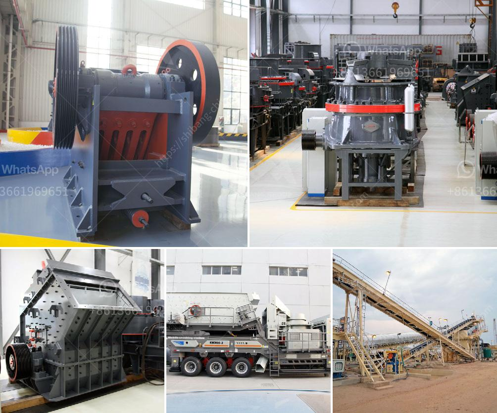

<h3>crusher machinery</h3>
Crusher machinery plays a crucial role in the stone crushing industry. As the backbone of infrastructure, construction and mining sectors, crusher machinery is used to crush and reduce the size of various materials such as granite, limestone, and concrete. Moreover, it is also used in recycling of waste materials, enabling builders to reuse them in constructing new structures.

The primary purpose of crusher machinery is to reduce the size of raw materials, enabling proper processing and sorting. Crushing machines come in various sizes and capacities, ensuring that there is a machine suitable for every job. Whether you need a small portable crusher or a large rock crusher machine, you can find one that suits your needs.

The process of crushing involves feeding the raw materials into the crusher, applying a high amount of pressure to break them down into smaller pieces. This can be accomplished through different types of crushers like jaw crushers, impact crushers, cone crushers, and vertical shaft impact crushers. Each type of crusher has its specific functions, benefits, and limitations, and choosing the right one for your project is essential.

Crusher machinery is equipped with powerful components that facilitate efficient crushing operations, making it easier to achieve desired product sizes. Additionally, modern crushers are designed with advanced features like adjustable settings, overload protection, and automatic lubrication systems, ensuring smooth operation and increased durability.

The benefits of investing in crusher machinery are numerous. It not only saves time and labor but also improves overall productivity. With the right crusher equipment, you can effectively process and utilize various materials, reducing waste, and optimizing resources. Furthermore, it helps in reducing transportation costs by enabling on-site crushing, eliminating the need for transporting materials from quarries.

In conclusion, crusher machinery is an essential equipment in the stone crushing industry. It has revolutionized the way materials are processed and used, making construction projects more efficient and environmentally friendly. If you are in the construction or mining industry, investing in a crusher machine is a wise decision that will reap long-term benefits.
<h3>Contact us</h3><ul><li><strong>Whatsapp:&nbsp;<a href="https://wa.me/8613661969651">+8613661969651</a></strong></li><li><a href="https://swt.shibang-china.com/?git&amp;zhl&amp;crusher machinery"><strong>Online Service(chat now)</strong></a></li></ul><h3>Related</h3><ul><li><a href='petitpierre 20tph rapport de projet.md'>petitpierre 20tph rapport de projet</a></li><li><a href='trommel small mobile wash plants for sale.md'>trommel small mobile wash plants for sale</a></li><li><a href='cocoa processing plant in nigeria.md'>cocoa processing plant in nigeria</a></li><li><a href='crusher machine for sale south africa.md'>crusher machine for sale south africa</a></li><li><a href='aggregate screens and crushers.md'>aggregate screens and crushers</a></li></ul>