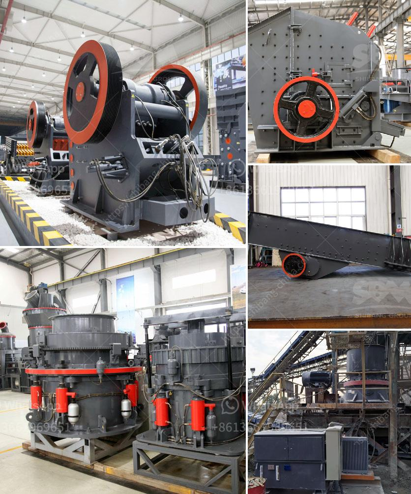

<h3>crusher made in taiwan</h3>
Taiwan, known for its technological advancements and high-quality manufacturing, has become synonymous with producing top-of-the-line industrial equipment. One such product that has gained recognition worldwide is the crusher made in Taiwan. Renowned for its exceptional craftsmanship, efficiency, and reliability, the crusher made in Taiwan has set the standard for crushing and grinding machines globally.

When it comes to machinery, quality is of utmost importance, and Taiwanese manufacturers pride themselves on delivering unmatched standards. The crusher, designed and manufactured in Taiwan, is a perfect example of the country's commitment to excellence. These crushers are meticulously developed using advanced technologies, ensuring reliable performance, extended durability, and outstanding productivity.

One of the key aspects of the crusher made in Taiwan is its strong body structure. Constructed with high-quality materials, such as steel alloys and reinforced components, Taiwanese crushers are capable of withstanding heavy loads and extreme working conditions. This robust design not only ensures longevity but also enhances safety, reducing the risk of machinery failure or accidents during operation.

Efficiency is another hallmark of the crusher made in Taiwan. These machines are engineered to maximize productivity while minimizing energy consumption. Advanced features, such as optimized crushing chambers and efficient motor systems, enable Taiwanese crushers to deliver superior crushing performance with reduced power requirements.

Moreover, Taiwanese crushers are known for their versatility and adaptability. Manufacturers in Taiwan understand the diverse needs of global industries and design crushers that can process various materials, including minerals, ores, rocks, and even non-metallic substances. This flexibility allows customers to achieve their specific crushing goals while ensuring high-quality end products.

In addition to their technical prowess, the crusher made in Taiwan comes with unparalleled customer support. Taiwanese manufacturers prioritize customer satisfaction, providing comprehensive after-sales services, including maintenance, spare parts, and technical assistance. This commitment to customer care ensures that the crusher remains in optimal condition throughout its lifespan, adding further value to the investment.

The globalization of the industrial sector has fueled the demand for efficient and reliable machinery across the globe. Recognizing this trend, Taiwanese crusher manufacturers have expanded their distribution channels, making their products easily accessible in various markets. The crusher made in Taiwan has gained a stellar reputation worldwide and proved its mettle in industries ranging from mining and construction to recycling and more.

As industries continue to prioritize sustainable practices, Taiwanese crushers have also evolved to meet environmental standards. Manufacturers in Taiwan have implemented innovative technologies to minimize dust, noise, and emissions, providing eco-friendly crushing solutions without compromising on performance.

In conclusion, the crusher made in Taiwan is a testament to the country's expertise and dedication to manufacturing excellence. With its robust construction, exceptional efficiency, and versatility, this machine has become a beacon of quality in the global industrial arena. Taiwanese manufacturers continue to set new benchmarks with their customer-centric approach and commitment to sustainability. Investing in a crusher made in Taiwan ensures a reliable, efficient, and long-lasting solution for businesses worldwide.
<h3>Contact us</h3><ul><li><strong>Whatsapp:&nbsp;<a href="https://wa.me/8613661969651">+8613661969651</a></strong></li><li><a href="https://swt.shibang-china.com/?git&amp;zhl&amp;crusher made in taiwan"><strong>Online Service(chat now)</strong></a></li></ul><h3>Related</h3><ul><li><a href='work of conveyor belts in peru.md'>work of conveyor belts in peru</a></li><li><a href='marble quarry mining in sudan.md'>marble quarry mining in sudan</a></li><li><a href='price of mobile crusher in the philippines.md'>price of mobile crusher in the philippines</a></li><li><a href='mica minerals powder grinding unit in kenya.md'>mica minerals powder grinding unit in kenya</a></li><li><a href='jaw industry limestone process.md'>jaw industry limestone process</a></li></ul>