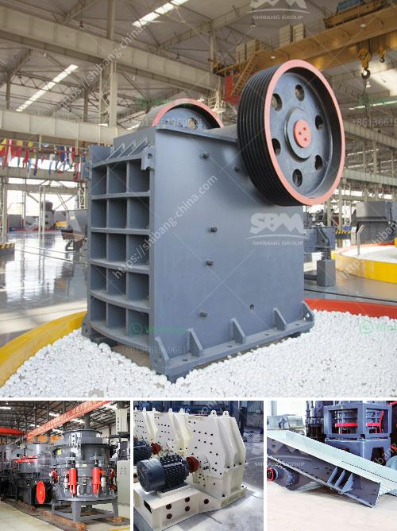

<h3>crusher manufacturers in turkey</h3>
Turkey, officially known as the Republic of Turkey, is a country located in Eurasia. It is a transcontinental nation with a landmass spanning both Europe and Asia. Over the years, Turkey has emerged as a significant player in the global machinery and equipment sector, particularly in the field of crusher manufacturing. Crushers are used to crush large rocks, stones, ores, or any other hard material into smaller pieces, as per the requirement. Today, a variety of crushers are manufactured by Turkish companies, encompassing different designs, specifications, and features.

Turkey has a rich history of mining, which has led to the development of various resources and technologies in the sector. The country's strategic location has also played a vital role in establishing it as a prominent manufacturing hub. Turkish crusher manufacturers have been building a strong presence in the industry and have been providing a wide range of products for several years. This has enabled the manufacturers to diversify their product portfolio and offer advanced solutions to the market.

One of the key factors contributing to the success of the Turkish crusher manufacturers is the growing construction industry in the country. The government's ambitious infrastructure development plans have led to rapid urbanization and an increased demand for crushers. This has created a lucrative market for Turkish manufacturers, who have been able to capitalize on the increasing demand and expand their operations.

Turkish crusher manufacturers have been heavily investing in research and development to meet the diverse needs of the customers. For instance, in order to break down rocks and stones effectively and efficiently, crushers need to be strong, durable, and resistant to corrosion. Turkish companies have been utilizing advanced materials and technologies to develop high-quality crushers that can withstand the harsh conditions in the mining and construction industry. These crushers are designed to be energy-efficient and environmentally friendly, ensuring minimal impact on the surroundings.

Furthermore, Turkish crusher manufacturers are also expanding their overseas distribution network to reach a wider global audience. They have been participating in international trade fairs and exhibitions to showcase their products and establish strong business relationships with potential customers and partners. The export of Turkish crushers has been steadily growing, with countries such as the United States, Europe, and Asia being the primary destinations. This growth in exports has not only boosted the revenue of Turkish manufacturers but has also contributed to the country's economy.

In conclusion, Turkish crusher manufacturers have made significant contributions to the mining and construction industry in recent years. Their range of crushers caters to the diverse needs of customers around the world and has helped build Turkey's reputation as a reliable and innovative manufacturer. With ongoing investments in research and development and a strong focus on quality, Turkish manufacturers are poised to continue their growth and make further advancements in the field of crusher manufacturing.
<h3>Contact us</h3><ul><li><strong>Whatsapp:&nbsp;<a href="https://wa.me/8613661969651">+8613661969651</a></strong></li><li><a href="https://swt.shibang-china.com/?git&amp;zhl&amp;crusher manufacturers in turkey"><strong>Online Service(chat now)</strong></a></li></ul><h3>Related</h3><ul><li><a href='calculation of cement ball mill capacity.md'>calculation of cement ball mill capacity</a></li><li><a href='china crusher contact australia.md'>china crusher contact australia</a></li><li><a href='iron ore process crushing.md'>iron ore process crushing</a></li><li><a href='crushing plant adalah.md'>crushing plant adalah</a></li><li><a href='stone crusher made in malaysia.md'>stone crusher made in malaysia</a></li></ul>