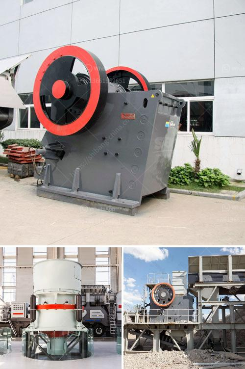

<h3>crusher manufactures in europe</h3>
Crushers play a key role in the mining industry, which employs millions of individuals worldwide for extracting coveted minerals and other valuable resources. In Europe, there are several prominent crusher manufacturers who have tirelessly been working towards improving the performance and reliability of their machines. These manufacturing companies have not only contributed to the growth of the European mining industry but have also established a strong presence in international markets.

One of the leading crusher manufacturers in Europe is Metso Corporation. This Finland-based company has been successfully catering to the mining and construction industries for over a century. Known for its high-quality crushers, Metso offers a comprehensive range of equipment that caters to various crushing needs. From jaw crushers to cone crushers and impact crushers, Metso's crushers are designed to provide reliability, durability, and high performance.

Another prominent European crusher manufacturer is Sandvik, which has been providing innovative and cost-effective crushing solutions since 1862. Sandvik's crushers are renowned for their advanced features, optimal efficiency, and user-friendly operation. Whether it is a primary jaw crusher or a secondary cone crusher, Sandvik's products excel in terms of reliability, productivity, and durability.

Germany-based Thyssenkrupp also ranks among the top crusher manufacturers in Europe. For more than a century, this renowned company has been providing crushing solutions for the mining and quarrying industries. Thyssenkrupp's range of crushers includes jaw crushers, impact crushers, and cone crushers, all designed to provide a reliable, efficient, and cost-effective crushing solution.

Europe is also home to many other crusher manufacturers, such as Keestrack, RUBBLE MASTER, and FABO. These companies offer a wide range of crushers, from compact mobile crushers to stationary crushing plants.

Overall, crusher manufacturers in Europe ensure that mining and construction industries can continue their operations smoothly by providing innovative, reliable, and durable crushing equipment. With their extensive experience and expertise, these manufacturers are contributing to the growth and development of the European mining industry while catering to global markets as well.
<h3>Contact us</h3><ul><li><strong>Whatsapp:&nbsp;<a href="https://wa.me/8613661969651">+8613661969651</a></strong></li><li><a href="https://swt.shibang-china.com/?git&amp;zhl&amp;crusher manufactures in europe"><strong>Online Service(chat now)</strong></a></li></ul><h3>Related</h3><ul><li><a href='gold mining equipment south africa.md'>gold mining equipment south africa</a></li><li><a href='granite stone hand engraving machine in india.md'>granite stone hand engraving machine in india</a></li><li><a href='fortius roller mill.md'>fortius roller mill</a></li><li><a href='copper crusher plant for sale chile.md'>copper crusher plant for sale chile</a></li><li><a href='stone crusher machine manufacturer in ethiopia.md'>stone crusher machine manufacturer in ethiopia</a></li></ul>