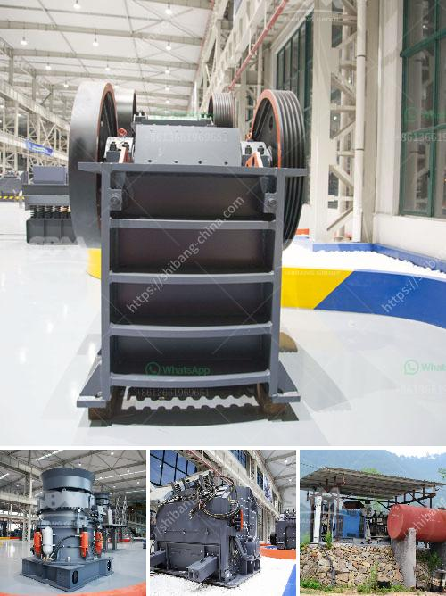

<h3>crusher mobile stone</h3>
With the advancement of technology, the crusher mobile stone crushing machinery has emerged as a revolutionizing solution in the mining industry. The ability to crush large stones into smaller chunks with ease and efficiency is truly a game-changer. This article will explore the key features and benefits of crusher mobile stone, highlighting why it is the perfect solution for efficient crushing.

One of the standout features of crusher mobile stone is its mobility. Unlike traditional stone crushing machines, a crusher mobile stone can be easily moved from one location to another. This eliminates the need for costly transportation and reduces downtime during the crushing process. Whether it is in a quarry or on a construction site, crusher mobile stone offers unparalleled convenience and flexibility.

The crusher mobile stone is designed to cater to various crushing needs. It can handle a wide range of materials, including limestone, granite, basalt, river stone, iron ore, etc. The crusher mobile stone ensures maximum productivity and durability. The powerful crushing mechanism allows for consistent and uniform particle size, resulting in a high-quality end product.

Furthermore, crusher mobile stone is equipped with advanced safety features to ensure operator safety. Remote control operation eliminates direct contact with hazardous materials, reducing the risk of accidents. Additionally, the automated systems within the crusher mobile stone provide real-time monitoring and alert the operator of any potential issues. This proactive approach to safety makes crusher mobile stone a reliable and secure solution for crushing operations.

Another significant advantage of crusher mobile stone is its reduced environmental impact. This crushing machinery is designed to minimize dust and noise pollution. The efficient dust suppression system ensures that the surrounding environment remains unaffected. Additionally, the low noise emission makes the crusher mobile stone ideal for urban areas or noise-sensitive zones.

The crusher mobile stone also offers cost savings for businesses. With its high efficiency and productivity, it requires less energy and resources compared to traditional crushing machines. The reduced maintenance and downtime result in increased operational efficiency. Additionally, the ability to crush stones on-site eliminates transportation costs, saving both time and money.

In conclusion, the crusher mobile stone has revolutionized the mining industry. Its mobility, versatility, and safety features make it the perfect solution for efficient crushing operations. With its ability to handle various materials and produce high-quality end products, crusher mobile stone maximizes productivity and ensures operational efficiency. Furthermore, its environmental-friendly design reduces the impact on the surroundings, making it an eco-friendly choice. For businesses looking for cost-effective and reliable crushing machinery, crusher mobile stone is the ideal investment.
<h3>Contact us</h3><ul><li><strong>Whatsapp:&nbsp;<a href="https://wa.me/8613661969651">+8613661969651</a></strong></li><li><a href="https://swt.shibang-china.com/?git&amp;zhl&amp;crusher mobile stone"><strong>Online Service(chat now)</strong></a></li></ul><h3>Related</h3><ul><li><a href='basalt rock quarry plant.md'>basalt rock quarry plant</a></li><li><a href='cost of 150tph cement grinding plant.md'>cost of 150tph cement grinding plant</a></li><li><a href='salvage value of crusher machine.md'>salvage value of crusher machine</a></li><li><a href='limestone powder mill.md'>limestone powder mill</a></li><li><a href='dry mix mortar plant from turkey.md'>dry mix mortar plant from turkey</a></li></ul>