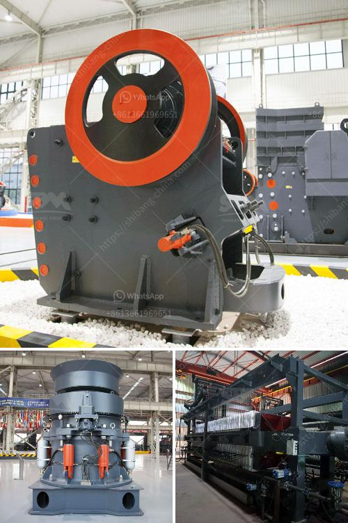

<h3>crusher operator salary in uae and dubai</h3>
The development and rapid growth of the construction industry in the United Arab Emirates (UAE) and Dubai has created a significant demand for various types of equipment and machinery, including crushers. As a result, the role of a crusher operator has become increasingly important in these cities. In this article, we will explore the salary expectations for crusher operators in UAE and Dubai and shed light on the factors that influence their earnings.

The primary responsibility of a crusher operator is to ensure the efficient operation and maintenance of crushers and other related equipment. This includes monitoring equipment, completing regular maintenance tasks, troubleshooting malfunctions, and performing necessary repairs. Given the critical nature of the job, crusher operators are in high demand and can expect competitive salaries.

On average, the salary range for crusher operators in UAE and Dubai typically starts from AED 2,000 and can go up to AED 12,000 per month, depending on the level of experience, skills, and qualifications held by the operator. Entry-level crusher operators with little to no experience may start at the lower end of the salary scale, while operators with several years of experience and advanced skills may command higher salaries.

Several factors influence the salary expectations for crusher operators in UAE and Dubai. Firstly, the level of experience plays a significant role. Those with more experience are likely to have a better understanding of crusher operations and maintenance, making them more valuable to employers. Consequently, they can negotiate higher salaries based on their specialized expertise.

Furthermore, the type and size of the organization also impact a crusher operator's salary. Large construction companies or quarry operators tend to offer higher salaries compared to smaller employers. Larger companies often have more advanced and complex equipment, which requires skilled crusher operators to ensure smooth operations. As a result, they are willing to invest more in attracting and retaining skilled personnel.

Other factors that affect salary expectations for crusher operators include educational qualifications, specific training, and certifications. Individuals who possess relevant qualifications or certifications in equipment operation and maintenance have an advantage when negotiating higher salaries. These additional credentials demonstrate a commitment to professional growth and competence, making them more desirable to employers.

Additionally, the geographic location also plays a role in determining salaries for crusher operators in the UAE and Dubai. Dubai, being a more cosmopolitan and developed city, generally offers higher salaries compared to other regions within the UAE. The cost of living, lifestyle, and demand for skilled labor in Dubai contribute to the higher salary expectations.

In conclusion, working as a crusher operator in the UAE and Dubai presents a promising job opportunity with competitive salaries. The rapid growth of the construction industry, the demand for crushers, and the specialized skills required for this role make crusher operators highly sought after. By acquiring relevant qualifications, gaining experience, and developing advanced skills, crusher operators can position themselves for higher salaries and long-term growth prospects in this thriving industry.
<h3>Contact us</h3><ul><li><strong>Whatsapp:&nbsp;<a href="https://wa.me/8613661969651">+8613661969651</a></strong></li><li><a href="https://swt.shibang-china.com/?git&amp;zhl&amp;crusher operator salary in uae and dubai"><strong>Online Service(chat now)</strong></a></li></ul><h3>Related</h3><ul><li><a href='quartz plant manufacturing process.md'>quartz plant manufacturing process</a></li><li><a href='stone crusher project report.md'>stone crusher project report</a></li><li><a href='sand screen with vibrator.md'>sand screen with vibrator</a></li><li><a href='cement clinker processing plant.md'>cement clinker processing plant</a></li><li><a href='raymond 5 roller mill.md'>raymond 5 roller mill</a></li></ul>