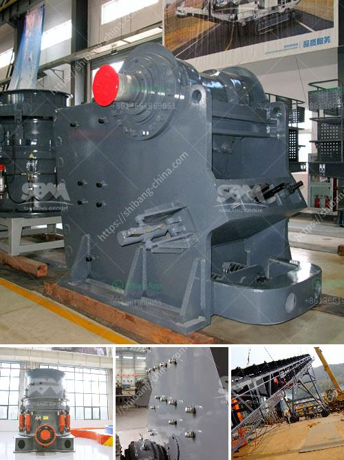

<h3>crusher pirdra crusher puedra</h3>
Crusher Pirdra, also known as Crusher Puedra, is a captivating character in the world of manga and anime. Created by the talented artist Hiro Mashima, Crusher Pirdra has won the hearts of fans worldwide with her unique personality and incredible abilities.

The story of Crusher Pirdra revolves around a young girl named Lucy Heartfilia who dreams of joining the prestigious Fairy Tail Guild. However, her journey takes an unexpected turn when she encounters Crusher Pirdra, an enigmatic figure with a mysterious past.

Despite her petite appearance, Crusher Pirdra possesses immense strength and agility. She wields a magical hammer called Riot Blitz, which gives her the power to manipulate earth and rock. Crusher Pirdra's signature move, Rock Cannon, unleashes a devastating burst of energy capable of destroying anything in its path.

What sets Crusher Pirdra apart from other characters is her unwavering determination and resilience. She never backs down from a challenge, no matter how formidable. Crusher Pirdra's indomitable spirit inspires those around her and serves as a reminder to never give up.

Furthermore, Crusher Pirdra's character development throughout the series is commendable. Initially portrayed as a solitary individual, she gradually opens up to her newfound friends, forming deep bonds with them. Her interactions with other characters highlight the importance of trust and teamwork, emphasizing the power of friendship in overcoming adversity.

Crusher Pirdra's backstory is also captivating. Born into a family of legendary warriors, she must confront her past and come to terms with her lineage. As the series progresses, her past intertwines with her present, presenting her with challenges that test her resolve.

Crusher Pirdra's journey is not only about personal growth and self-discovery, but it also delves into complex themes such as redemption and forgiveness. She is faced with choices that force her to confront her own demons and make amends for past mistakes. Her evolution as a character inspires fans to reflect on their own actions and search for redemption in their own lives.

Crusher Pirdra's impact goes beyond the fictional realm. She has become an icon for empowerment, particularly for young girls. Her strength and determination serve as a reminder that anyone can achieve their dreams and conquer any obstacles they may face.

In conclusion, Crusher Pirdra's character is a testament to the power of storytelling and its ability to inspire and resonate with audiences. Her journey, filled with challenges, growth, and friendship, captivates fans and leaves a lasting impression. Whether it's her incredible powers, her unwavering determination, or her relatable struggles, Crusher Pirdra is a character that continues to captivate the hearts of fans worldwide.
<h3>Contact us</h3><ul><li><strong>Whatsapp:&nbsp;<a href="https://wa.me/8613661969651">+8613661969651</a></strong></li><li><a href="https://swt.shibang-china.com/?git&amp;zhl&amp;crusher pirdra crusher puedra"><strong>Online Service(chat now)</strong></a></li></ul><h3>Related</h3><ul><li><a href='two roll mill machine.md'>two roll mill machine</a></li><li><a href='high gradient separator in zhengzhou.md'>high gradient separator in zhengzhou</a></li><li><a href='stationary crushers and screens.md'>stationary crushers and screens</a></li><li><a href='price list coal crusher plant 1500 ton hour.md'>price list coal crusher plant 1500 ton hour</a></li><li><a href='dubai dolomite crusher suppliers.md'>dubai dolomite crusher suppliers</a></li></ul>