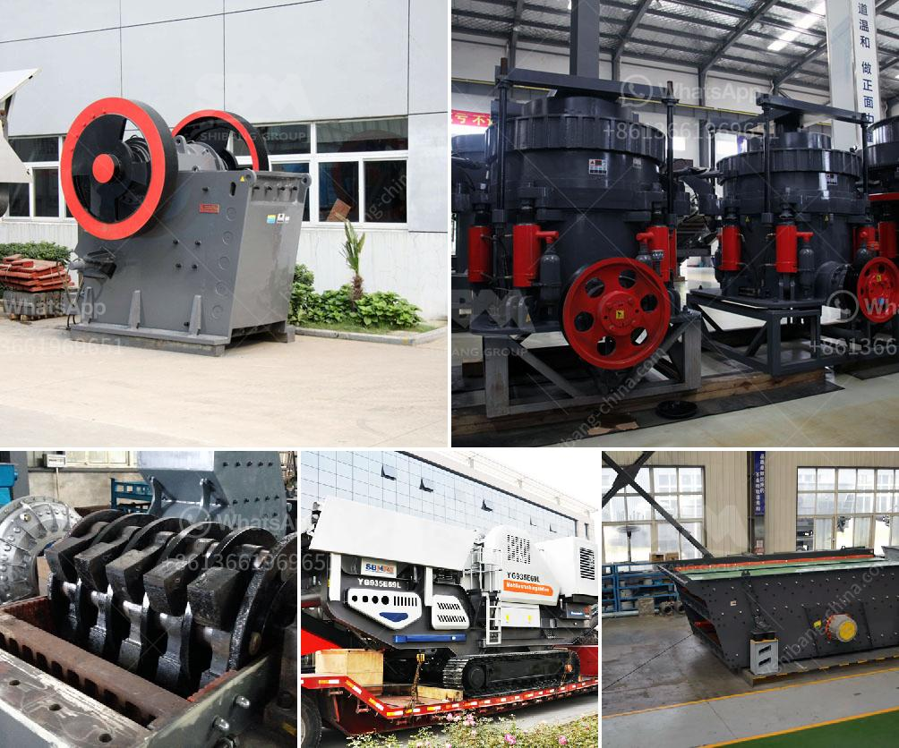

<h3>crusher plant dengan kapasitas 100 ton h</h3>
Crusher plant adalah sebuah unit pemrosesan yang digunakan untuk menghancurkan batu atau material lainnya menjadi ukuran yang lebih kecil. Crusher plant dengan kapasitas 100 ton/jam merupakan salah satu pilihan yang populer di kalangan industri konstruksi.

Kapasitas 100 ton/jam pada crusher plant ini menunjukkan kemampuan unit pemrosesan ini untuk menghancurkan material sebanyak 100 ton dalam satu jam. Hal ini membuat crusher plant dengan kapasitas seperti ini sangat sesuai untuk kebutuhan produksi yang besar. 

Crusher plant dengan kapasitas 100 ton/jam biasanya digunakan untuk mengolah material seperti batu pecah, pasir, kerikil, dan bahan tambang lainnya. Material-material ini kemudian akan dihancurkan menjadi ukuran yang lebih kecil menggunakan mesin crusher yang terdapat di dalam unit pemrosesan ini.

Kelebihan dari crusher plant dengan kapasitas 100 ton/jam adalah kecepatan pemrosesan yang tinggi. Dengan kapasitas yang besar, unit ini dapat menghancurkan material dalam jumlah yang besar dengan waktu yang relatif singkat. Hal ini memungkinkan pihak industri untuk mempercepat produksi dan memenuhi permintaan pasar yang tinggi.

Selain itu, crusher plant ini juga dilengkapi dengan sistem penggerak yang kuat dan efisien. Dengan peralatan yang canggih tersebut, unit pemrosesan ini dapat beroperasi dengan lancar dan stabil. Keselamatan kerja juga menjadi perhatian dalam pembuatan crusher plant dengan kapasitas seperti ini, sehingga risiko kecelakaan dapat diminimalisasi.

Namun, dalam penggunaannya, pemilik crusher plant perlu memperhatikan aspek lingkungan. Peningkatan produksi yang pesat dapat berdampak pada kerusakan lingkungan jika tidak diawasi dengan baik. Oleh karena itu, pemeliharaan dan pengelolaan limbah dari crusher plant ini sangat penting untuk menjaga keseimbangan alam.

Dalam kesimpulan, crusher plant dengan kapasitas 100 ton/jam memberikan solusi efisien dan handal dalam pemrosesan material konstruksi. Kecepatan tinggi dan kemampuan menghancurkan material dalam jumlah besar menjadikan crusher plant ini sangat berharga dalam industri. Namun, aspek lingkungan juga perlu diperhatikan agar kesinambungan alam tetap terjaga saat menggunakan unit pemrosesan ini.
<h3>Contact us</h3><ul><li><strong>Whatsapp:&nbsp;<a href="https://wa.me/8613661969651">+8613661969651</a></strong></li><li><a href="https://swt.shibang-china.com/?git&amp;zhl&amp;crusher plant dengan kapasitas 100 ton h"><strong>Online Service(chat now)</strong></a></li></ul><h3>Related</h3><ul><li><a href='hydraulic impact crusher.md'>hydraulic impact crusher</a></li><li><a href='small scale gold mining machine and their price.md'>small scale gold mining machine and their price</a></li><li><a href='stone grinding plant.md'>stone grinding plant</a></li><li><a href='gypsum board manufacturing machine india.md'>gypsum board manufacturing machine india</a></li><li><a href='crusher unit manufacturer india.md'>crusher unit manufacturer india</a></li></ul>