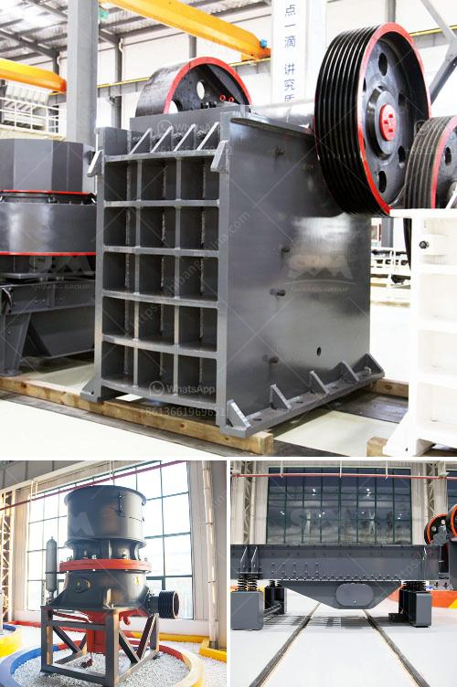

<h3>crusher plant for sale china</h3>
A crusher plant for sale China is a desirable equipment for those looking to invest in a project. It aims to reduce the large rocks into smaller gravels and even dust particles for construction purposes. Besides, reducing the size of the material helps to separate valuable minerals from unwanted ones.

The Chinese crusher plant for sale is particularly suited for producing large quantities of cubical-shaped aggregate materials, which is desirable for many construction applications. Its robust design ensures high performance and longevity even in the toughest and most challenging conditions.

The crusher plant for sale China offers the complete range of track-mounted mobile crushers including jaw crushers, impact crushers, and cone crushers. The mobile crusher machines have the added advantage of being able to move quickly from one site to another, thus saving immense amounts of time and effort. Furthermore, the crushing machines can be operated remotely, reducing labor costs significantly.

In terms of the technology used in the Chinese crusher plant for sale, you will find devices that are state-of-the-art. You will have an opportunity to choose a hybrid mobile crushing plant or a fully mobile crushing plant depending on your location and project requirements. In addition to this, you also have a choice between vertical and horizontal screens.

In terms of capacity, a hydraulic cone crusher can be capped at 2200 tph while both cone crushers and jaw crushers can reach maximum production capacity of 1500 tph. Furthermore, a Chinese crusher plant for sale is built to be reliable in the hardest conditions, ensuring reliability and flexibility without compromising on performance.

Chinese crusher plants have been used widely in various fields of construction industry. A 300 tph crusher plant can operate for 24 hours a day with the help of an electric generator. This energy efficient plant comes with an extended service life due to its low maintenance designs.

The RIPRAP in the crusher plant for sale China is characterized by its high wear resistance, high strength, high compression resistance, low water absorption rate, good anti-skid performance, and good resistance to freeze-thaw cycles. It can withstand the harsh environment of high temperature, high humidity, and saline-alkali. This makes Chinese crusher plants suited for use in coastal and riverbank protection projects.

The Chinese crusher plant for sale is available in stationary, mobile and technically advanced track-mounted configurations. The crusher plant for sale China can be used to crush and process various minerals. Its reliable performance makes it suitable for use in various industries, including mining, metallurgy, building materials, transportation, and other industries.

In summary, a crusher plant for sale China is equipped with a diversified crushing machine so that you will obtain the materials in the right size. It can be adjusted depending on the actual needs of the users and the flexible integration of the supporting equipment makes it possible to greatly reduce operating costs. With the increasing demand for infrastructure construction, a crusher plant for sale China plays an important role in the construction industry.
<h3>Contact us</h3><ul><li><strong>Whatsapp:&nbsp;<a href="https://wa.me/8613661969651">+8613661969651</a></strong></li><li><a href="https://swt.shibang-china.com/?git&amp;zhl&amp;crusher plant for sale china"><strong>Online Service(chat now)</strong></a></li></ul><h3>Related</h3><ul><li><a href='crusher pirdra crusher puedra.md'>crusher pirdra crusher puedra</a></li><li><a href='crusehr equipment ball mill.md'>crusehr equipment ball mill</a></li><li><a href='iron processing machine in mexico.md'>iron processing machine in mexico</a></li><li><a href='crusher for rocks machine for sale in uae.md'>crusher for rocks machine for sale in uae</a></li><li><a href='stone crusher used for sale spain.md'>stone crusher used for sale spain</a></li></ul>