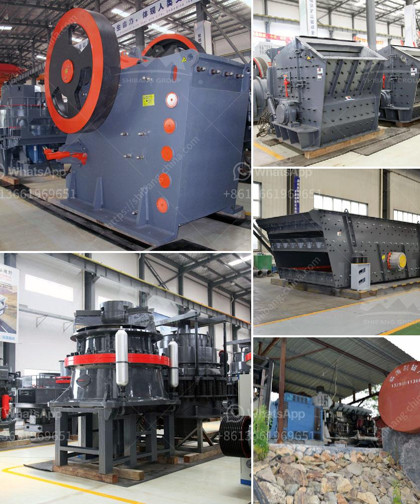

<h3>crusher plant in peshawar</h3>
Crusher plants are essential structures in industries such as mining, construction, and metallurgy. The purpose of a crusher plant is to reduce the size of stones, rock, and other similar materials into smaller sizes to make them useful for various applications. Peshawar, a bustling city in Pakistan, is home to several crusher plants that play a significant role in the local economy.

One of the primary advantages of Crusher plants in Peshawar is the availability of raw materials. The city is located in the Khyber Pakhtunkhwa province, known for its rich mineral resources. The surrounding areas of Peshawar are abundant with limestone, marble, and other stone deposits. These natural resources provide a steady supply of raw materials for crushing plants, ensuring a continuous production of crushed stones.

Crusher plants in Peshawar not only fulfill the local demand for construction materials but also contribute to the national economy. The crushed stones produced by these plants are used in various construction projects, including roads, bridges, buildings, and dams. Additionally, these plants supply stones to other nearby regions, reducing the transportation cost and environmental impact associated with long-distance transportation.

In recent years, there has been an increased focus on environmentally friendly practices in the Pakistani construction industry. Crusher plants in Peshawar have responded to this by adopting sustainable techniques and technologies. Dust suppression systems are installed to minimize air pollution during the crushing process. Additionally, water sprays are used on conveyor belts and other equipment to control the dispersion of dust particles.

Moreover, crusher plants in Peshawar have also embraced energy-efficient practices. They aim to reduce their energy consumption and carbon footprint by utilizing modern crushers and equipment. Energy-efficient motors and automation systems are employed to optimize energy usage and minimize wastage.

Overall, crusher plants in Peshawar play a crucial role in the local and national economy. They contribute to the construction sector, generate employment opportunities, and utilize the abundant natural resources. By adopting sustainable practices, these plants ensure environmental protection and promote a greener and more efficient future for the construction industry.
<h3>Contact us</h3><ul><li><strong>Whatsapp:&nbsp;<a href="https://wa.me/8613661969651">+8613661969651</a></strong></li><li><a href="https://swt.shibang-china.com/?git&amp;zhl&amp;crusher plant in peshawar"><strong>Online Service(chat now)</strong></a></li></ul><h3>Related</h3><ul><li><a href='crushing and screening costs.md'>crushing and screening costs</a></li><li><a href='major suppliers of jaw crusher in south africa.md'>major suppliers of jaw crusher in south africa</a></li><li><a href='business plan on quarry crusher.md'>business plan on quarry crusher</a></li><li><a href='rock belt conveyor spec.md'>rock belt conveyor spec</a></li><li><a href='india second hand ball mill for sale.md'>india second hand ball mill for sale</a></li></ul>