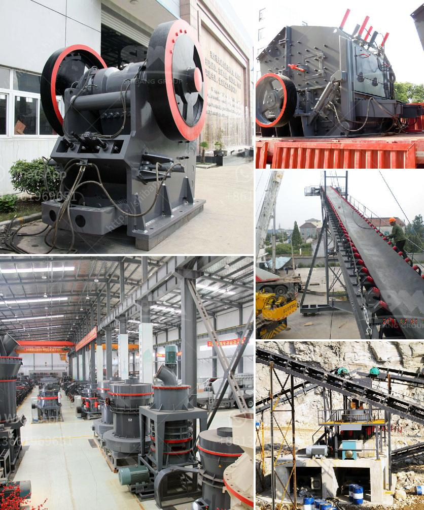

<h3>crusher plant in rows</h3>
Crusher plants are the backbone of modern society. They play a crucial role in providing raw materials for various construction activities such as building bridges, highways, and houses. Therefore, the demand for crusher plants is continuously increasing to meet the growing needs of the construction industry.

A crusher plant is a machine that reduces the size of raw materials, such as rocks or gravel, by applying force to the materials through a series of heavy-duty equipment. They are usually used in primary crushing stages, but they can also be utilized in secondary or tertiary crushing stages depending on the level of hardness of the raw materials.

One of the most critical aspects of a crusher plant is its ability to produce the desired end products efficiently. To achieve this, crusher plants are typically equipped with various crushing equipment such as crushers, screens, and conveyors. Each component works together to break down the raw materials into smaller manageable sizes and separate them based on their particle size.

Crushers are the heart of the crusher plant. They are designed to handle large-sized rocks with a compression strength of up to several hundred megapascals. The main types of crushers used in crushing plants include jaw crushers, cone crushers, impact crushers, and gyratory crushers. Each type has its unique features and advantages, making them suitable for different applications.

In addition to crushers, screens are also an essential component of a crusher plant. They are used to separate the crushed materials into different sizes or grades. Screens can be classified into vibrating screens, inclined screens, and horizontal screens, depending on their motion pattern. The size and type of screen used in a crusher plant depend on the desired end product specifications.

Conveyors are another vital part of a crusher plant. They are used to transport the raw materials from one stage of the crushing process to another. Conveyors can be stationary, portable, or mobile, depending on the specific requirements of the crusher plant. They help in enhancing the overall efficiency of the plant by reducing manual handling and minimizing material loss.

Furthermore, crusher plants can be operated using different power sources, including diesel engines, electric motors, or a combination of both. The choice of power source depends on factors such as cost, availability, and environmental concerns. Modern crusher plants are designed to be eco-friendly, with low emissions and energy consumption.

To ensure the smooth operation of a crusher plant, regular maintenance and inspections are necessary. It is essential to check the crusher's wear parts, such as jaw plates and blow bars, and replace them when necessary to maintain optimal crushing performance. Lubrication systems and conveyor belts should also be inspected to prevent any potential breakdowns or accidents.

In conclusion, crusher plants play a significant role in the mining and construction industries. They are powerful machines that crush raw materials into smaller sizes and produce the desired end products for various construction activities. With the advancement in technology, crusher plants have become more efficient, eco-friendly, and reliable. Regular maintenance and inspections are essential to ensure their optimal performance and extend their lifespan. As the demand for construction materials continues to grow, the importance of crusher plants will remain undeniably high.
<h3>Contact us</h3><ul><li><strong>Whatsapp:&nbsp;<a href="https://wa.me/8613661969651">+8613661969651</a></strong></li><li><a href="https://swt.shibang-china.com/?git&amp;zhl&amp;crusher plant in rows"><strong>Online Service(chat now)</strong></a></li></ul><h3>Related</h3><ul><li><a href='how to make good with limestone powder.md'>how to make good with limestone powder</a></li><li><a href='small scale gold mill from china.md'>small scale gold mill from china</a></li><li><a href='price limestone rock crusher.md'>price limestone rock crusher</a></li><li><a href='mining conveyor prices.md'>mining conveyor prices</a></li><li><a href='roller crusher brick making machine.md'>roller crusher brick making machine</a></li></ul>