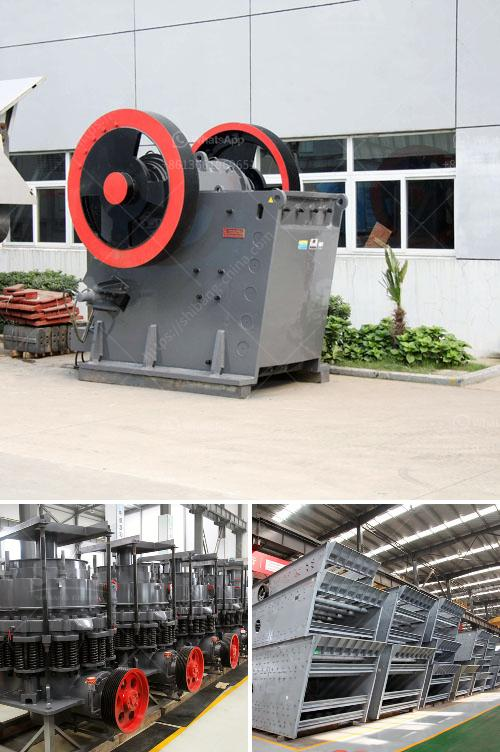

<h3>crusher plant in tarlac</h3>
Located in the province of Tarlac, in the Philippines, the crusher plant or commonly known as the crushing plant is responsible for the crushing and processing of various rock materials into aggregates that are used for construction purposes. 

With the booming infrastructure projects and construction activities in Tarlac, the need for high-quality aggregates has significantly increased. To meet this growing demand, the crusher plant in Tarlac plays a vital role as it produces different sizes of aggregates required for various construction applications.

The crusher plant in Tarlac is equipped with highly advanced crushing equipment, which ensures efficient and precise crushing of rocks. The primary crusher in the plant is responsible for reducing the size of the rocks to a manageable size, which is then conveyed to the secondary crusher for further processing. This process ensures that the final product meets the desired specifications.

Moreover, the crusher plant follows rigorous quality control measures to ensure that the aggregates produced are of the highest quality. This includes conducting regular tests on the raw materials, intermediate products, and the final product to ensure that they meet the required standards. This commitment to quality ensures that the aggregates from the crusher plant are durable and can withstand the demands of various construction applications.

Additionally, the crusher plant in Tarlac operates in an environmentally friendly manner. It adheres to strict environmental regulations and takes measures to mitigate any potential impact on the surrounding ecosystem. This includes proper waste management practices and the use of dust control systems to minimize air pollution.

Overall, the crusher plant in Tarlac plays a crucial role in meeting the demand for aggregates in the construction industry. Its efficient operations, commitment to quality, and adherence to environmental regulations make it a reliable and sustainable source of high-quality aggregates for various construction projects in the province.
<h3>Contact us</h3><ul><li><strong>Whatsapp:&nbsp;<a href="https://wa.me/8613661969651">+8613661969651</a></strong></li><li><a href="https://swt.shibang-china.com/?git&amp;zhl&amp;crusher plant in tarlac"><strong>Online Service(chat now)</strong></a></li></ul><h3>Related</h3><ul><li><a href='harga mobile crusher in indonesia.md'>harga mobile crusher in indonesia</a></li><li><a href='pakistan quarry crusher manufacturer.md'>pakistan quarry crusher manufacturer</a></li><li><a href='rock crusher for crushing balsalt stone.md'>rock crusher for crushing balsalt stone</a></li><li><a href='jual grinding roll mill.md'>jual grinding roll mill</a></li><li><a href='jaw crusher application.md'>jaw crusher application</a></li></ul>