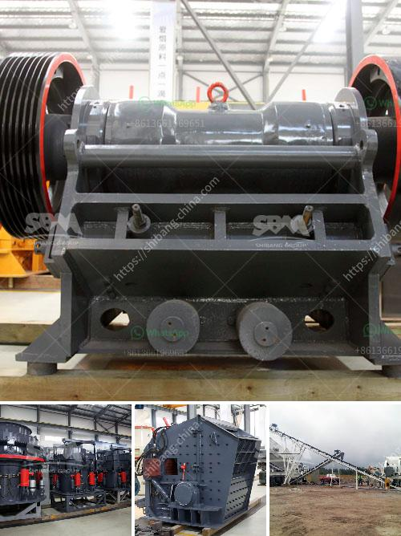

<h3>crusher plant made in uk</h3>
Crusher plants are built to help reduce the size of large rocks or gravel for construction purposes. These plants can be found in mines, quarries, and other industrial settings. These machines can be tailored to specific requirements, such as a particular hardness or desired output, making them highly efficient and versatile.

One of the countries known for its quality crusher plants is the United Kingdom. The UK is known for its strict quality standards when it comes to industries like construction. Therefore, it is no surprise that UK-made crusher plants are renowned for their durability and reliability.

One notable advantage of crusher plants made in the UK is the high-quality materials used in their construction. These plants are constructed using robust steel components that can withstand the toughest of conditions. The use of premium materials ensures that they can handle heavy-duty operations efficiently and effectively.

Furthermore, UK-made crusher plants incorporate advanced technology to optimize their performance. These machines are equipped with state-of-the-art features that contribute to their efficiency and productivity. For instance, they can be equipped with automatic control systems that allow for remote operation and monitoring. This enhances the safety and convenience of the plant operator, eliminating the need for on-site presence at all times.

In addition to their technological advancements, UK-made crusher plants also prioritize ease of maintenance and serviceability. These machines are designed with user-friendly interfaces and accessible parts, making maintenance tasks simpler and faster. This reduces downtime and increases overall productivity.

Another great advantage of crusher plants made in the UK is their versatility. They can be customized to meet specific requirements and specifications. Whether it's the desired output size, type of material being crushed, or the capacity needed, UK-made crusher plants can be tailored accordingly. This flexibility ensures that customers can find the right plant for their unique needs, ultimately enhancing efficiency and cost-effectiveness.

Furthermore, UK-made crusher plants comply with strict environmental regulations. These machines are designed to minimize dust and noise emissions, making them more eco-friendly. They employ advanced filtration systems and noise reduction measures to ensure compliance with environmental standards. By choosing a UK-made crusher plant, customers can contribute to a greener and more sustainable future.

Overall, crusher plants made in the UK are highly sought after due to their exceptional quality, durability, advanced technology, versatility, and adherence to environmental regulations. Investing in a UK-made crusher plant ensures long-term reliability, increased productivity, and cost-effectiveness. Whether it's for a small construction project or a large mining operation, a UK-made crusher plant will undoubtedly meet and exceed expectations.
<h3>Contact us</h3><ul><li><strong>Whatsapp:&nbsp;<a href="https://wa.me/8613661969651">+8613661969651</a></strong></li><li><a href="https://swt.shibang-china.com/?git&amp;zhl&amp;crusher plant made in uk"><strong>Online Service(chat now)</strong></a></li></ul><h3>Related</h3><ul><li><a href='mica processing technology and flow chart.md'>mica processing technology and flow chart</a></li><li><a href='granite quarry plant in sri lanka.md'>granite quarry plant in sri lanka</a></li><li><a href='power draw calculator of ball mill.md'>power draw calculator of ball mill</a></li><li><a href='iron ore mines buyers in india.md'>iron ore mines buyers in india</a></li><li><a href='mobile crusher plant supplier in the philippines.md'>mobile crusher plant supplier in the philippines</a></li></ul>