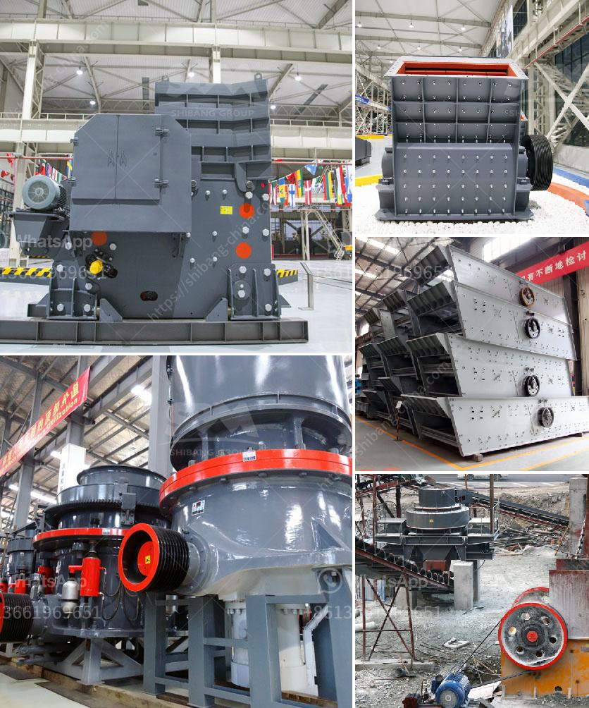

<h3>crusher plants south africa</h3>
Crusher plants in South Africa are widely used in mining, smelting, building materials, highways, railways, water conservancy, and chemical industries. With the development of South Africa's economy, many infrastructure improvements and expansions have been implemented, which has driven the demand for crushers. This article will provide an overview of crusher plants in South Africa.

Crusher plants refer to the stationary and mobile crushing equipment used in the quarrying, mining, and recycling industries. These plants consist of various components such as crushers, screens, conveyors, and feeders, with crushers being a crucial part of the operation. They are used to reduce the size of large rocks, stones, or other raw materials into smaller, more manageable sizes for further processing.

In South Africa, there are several types of crushers commonly used in crusher plants. These include jaw crushers, impact crushers, cone crushers, and vertical shaft impact crushers (VSI crushers). Each type has its own unique features and advantages, making them suitable for different applications.

Jaw crushers are commonly used in primary crushing stages and can crush large rocks and stones into smaller sizes. They have a simple design and are highly reliable, making them a popular choice in many industries. Impact crushers, on the other hand, are particularly suited for crushing soft or medium-hard materials. They produce excellent cubic-shaped end products and are often used in the mining and construction industries.

Cone crushers, on the other hand, are used primarily for secondary and tertiary crushing. They are designed to produce a higher percentage of fine particles and can handle a wide range of materials. VSI crushers, also known as sand making machines, are used for shaping and producing artificial sand. They are highly efficient in producing cubical-shaped end products and are widely used in the construction industry.

South Africa has a rich reserves of various minerals, including gold, manganese, platinum, vanadium, and chrome, among others. The mining industry plays a crucial role in the country's economy, and crusher plants are essential for extracting and processing these minerals. These plants not only contribute to the economic development of South Africa but also create job opportunities for many people.

In recent years, South Africa has experienced significant infrastructure development and expansion. This has increased the demand for crusher plants as they are essential components in the construction of roads, railway lines, bridges, buildings, and other infrastructure projects. The government of South Africa has implemented various initiatives to support and stimulate infrastructure development, providing a positive outlook for the crusher plant industry.

Furthermore, crusher plants in South Africa also promote recycling of construction waste and contribute to a sustainable environment. By crushing and reusing materials such as concrete, asphalt, and demolition waste, these plants help reduce the amount of waste ending up in landfills and minimize the need for extracting new raw materials.

In conclusion, crusher plants in South Africa play a crucial role in the mining, construction, and recycling industries. They are essential for extracting and processing minerals, building infrastructure, and promoting environmental sustainability. With the continuous development of South Africa's economy and infrastructure, the demand for crusher plants is expected to continue to grow, providing ample opportunities for growth and investment in the industry.
<h3>Contact us</h3><ul><li><strong>Whatsapp:&nbsp;<a href="https://wa.me/8613661969651">+8613661969651</a></strong></li><li><a href="https://swt.shibang-china.com/?git&amp;zhl&amp;crusher plants south africa"><strong>Online Service(chat now)</strong></a></li></ul><h3>Related</h3><ul><li><a href='30t hr 50t hr range stone crusher plant china.md'>30t hr 50t hr range stone crusher plant china</a></li><li><a href='gold milling equipment prices.md'>gold milling equipment prices</a></li><li><a href='stone crusher powder which products in use in philippines.md'>stone crusher powder which products in use in philippines</a></li><li><a href='barite mining process with photos.md'>barite mining process with photos</a></li><li><a href='tertiary impact crushers.md'>tertiary impact crushers</a></li></ul>