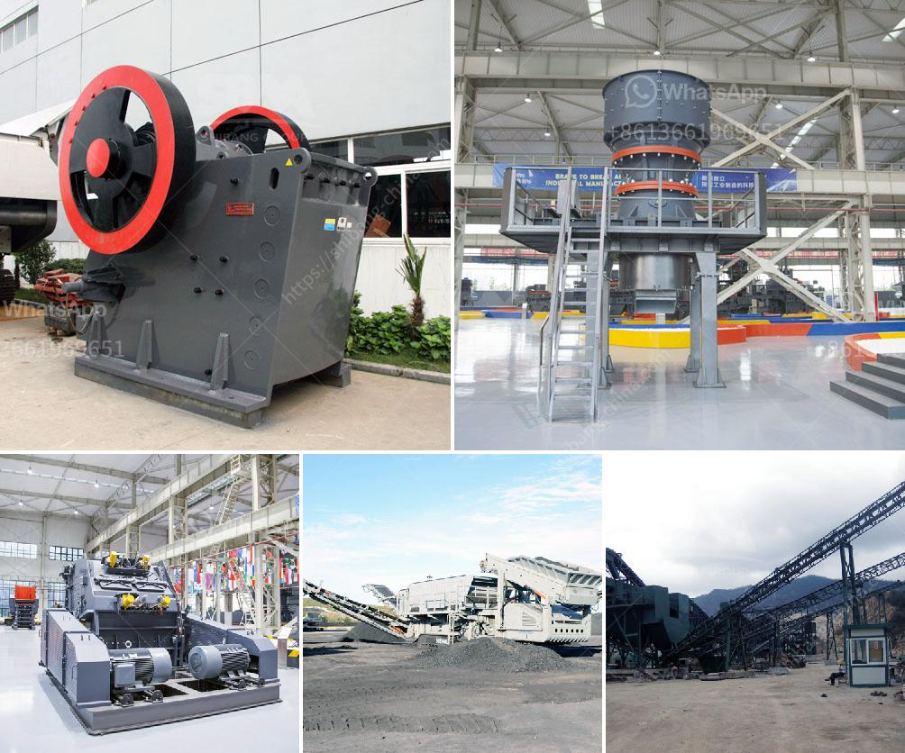

<h3>crusher portable mexico stone crusher</h3>
In today's fast-paced world, having the right equipment is crucial to ensuring that projects are completed efficiently and within schedule. The construction industry, in particular, relies heavily on machinery that can handle the toughest materials and provide reliable performance. This is where portable stone crushers come into play – with their ability to be easily transported and set up in various locations, they provide a convenient solution for contractors and construction companies alike.

One region where the demand for portable stone crushers is particularly high is Mexico. With its expanding construction and infrastructure projects, there is a growing need for reliable equipment that can handle the demanding tasks of crushing stones, rocks, and other materials. The Mexican construction industry is no stranger to challenges, with rugged terrains, remote locations, and limited access to electricity being common obstacles. This is where a crusher portable Mexico stone crusher proves to be invaluable.

A crusher portable Mexico stone crusher offers multiple advantages to construction companies. The compact design allows for the machine to be easily transported to different job sites, assuming even the most challenging terrains. Whether it's a construction site deep in the mountains or a remote area where roads are scarce, a portable stone crusher can be quickly set up and put to work. This mobility eliminates the need for multiple machines and reduces transportation costs, a key factor in Mexico's vast and diverse landscape.

One of the key features of a crusher portable Mexico stone crusher is its versatility. These machines are designed to handle a wide range of materials, including rocks, concrete, and asphalt. This allows contractors to crush and recycle various materials, reducing waste and contributing to a more sustainable and environmentally-friendly approach to construction. Additionally, the crushers are equipped with different screens that allow for the production of different sizes of material, ensuring that contractors can meet the specific requirements of each project.

Another advantage of a crusher portable Mexico stone crusher is its ease of operation. These machines are designed with user-friendliness in mind, allowing even those with no previous experience to operate the equipment efficiently. The crushers typically feature a simple control panel, providing operators with easy access to the various functions and settings. Along with this, safety features such as emergency stops and automatic shutdown mechanisms are incorporated into the design, ensuring the highest level of safety for operators and nearby workers.

Lastly, the adaptability and durability of a crusher portable Mexico stone crusher cannot be overlooked. These machines are built to withstand the toughest working conditions, whether it's extreme weather or the constant wear and tear of crushing hard materials. The crushers are engineered with robust frames and high-quality components that can handle the harshest environments. Additionally, many of the crushers can be equipped with additional features such as dust suppression systems, further enhancing their efficiency and adaptability.

In conclusion, the crusher portable Mexico stone crusher offers a reliable and convenient solution for contractors and construction companies in Mexico. With their mobility, versatility, ease of operation, and durability, these machines are designed to handle the toughest materials and provide efficient crushing capabilities. Whether it's a small-scale project or a large infrastructure development, a portable stone crusher can be a game-changer, ensuring that projects are completed on time and within budget.
<h3>Contact us</h3><ul><li><strong>Whatsapp:&nbsp;<a href="https://wa.me/8613661969651">+8613661969651</a></strong></li><li><a href="https://swt.shibang-china.com/?git&amp;zhl&amp;crusher portable mexico stone crusher"><strong>Online Service(chat now)</strong></a></li></ul><h3>Related</h3><ul><li><a href='used stone crushers for sale from uae.md'>used stone crushers for sale from uae</a></li><li><a href='impact crusher vsi price alibaba.md'>impact crusher vsi price alibaba</a></li><li><a href='iron ore beneficiation plant consultants in india.md'>iron ore beneficiation plant consultants in india</a></li><li><a href='how to setting up of stone crusher unit.md'>how to setting up of stone crusher unit</a></li><li><a href='tempat rental stone crusher.md'>tempat rental stone crusher</a></li></ul>