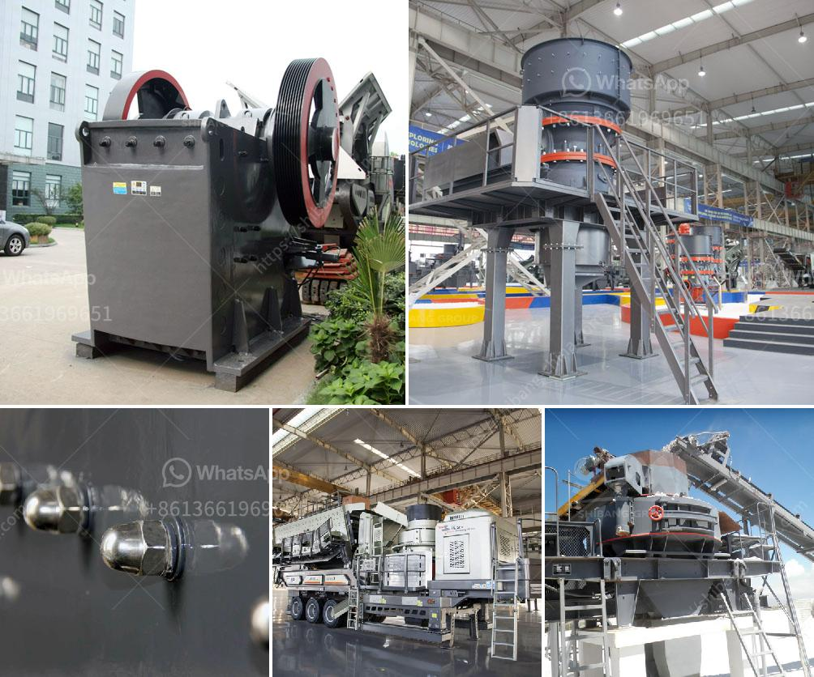

<h3>crusher price china</h3>
When it comes to buying a crusher, one of the key factors to consider is the price. Price not only affects our decision-making process but also determines the affordability and feasibility of the purchase. In recent years, China has emerged as a major player in manufacturing crushers, offering a wide range of options to buyers across the globe. Understanding the factors behind the crusher price in China can help buyers make informed decisions and ensure they get the best value for their money.

One of the primary contributors to the crusher price in China is the cost of raw materials. China being a manufacturing hub, sources its raw materials both domestically and internationally. The fluctuation in the prices of these raw materials, such as steel, has a direct impact on the overall price of the crusher. Buyers should keep an eye on global market trends and the availability of raw materials to assess how these factors can influence the price they are willing to pay.

Another important aspect is the manufacturing and labor costs. China's manufacturing sector is well-known for its efficiency and cost-effectiveness, which often translates into competitive prices. However, labor costs can vary depending on the region and the skill level required. Crushers with more complex features or specialized functions may have a higher price tag due to the expertise and attention to detail required during the manufacturing process. Buyers should assess their specific needs and budget to determine if they require these added features or can opt for a simpler model to save on costs.

Additionally, the brand and reputation of the manufacturer can significantly impact the crusher price in China. Established and well-known brands often command higher prices due to their reputation for quality and reliability. These brands invest in research and development, ensuring their products meet customer expectations and industry standards. However, it's essential to remember that lesser-known brands can offer equally competitive options at a lower cost. Buyers should carefully evaluate the brand reputation, customer reviews, and after-sales service to make an informed decision.

Transportation and logistics costs are also a significant contributor to the overall price of the crusher. China's vast geographical size means that buyers located far from manufacturing centers may incur higher transportation costs. Additionally, factors such as customs duties, taxes, and import regulations can impact the final price. It's crucial for buyers to consider these additional costs when budgeting for their crusher purchase and to factor in these expenses to avoid unexpected surprises along the way.

Lastly, it's important to remember that while price is an important consideration, it should not be the sole determining factor. Quality, performance, and after-sales support are equally vital aspects to consider when buying a crusher. Buyers should conduct thorough research, compare multiple options, and seek advice from industry experts to ensure they choose a reliable and efficient crusher that meets their specific requirements.

In conclusion, understanding the factors that contribute to the crusher price in China is crucial for buyers seeking to make an informed decision. Raw material costs, manufacturing and labor expenses, brand reputation, transportation costs, and additional expenses all play a role in determining the final price. By assessing their specific needs, researching multiple options, and considering various factors, buyers can select a crusher that offers the best value for their investment.
<h3>Contact us</h3><ul><li><strong>Whatsapp:&nbsp;<a href="https://wa.me/8613661969651">+8613661969651</a></strong></li><li><a href="https://swt.shibang-china.com/?git&amp;zhl&amp;crusher price china"><strong>Online Service(chat now)</strong></a></li></ul><h3>Related</h3><ul><li><a href='quarry equipment for sale in china.md'>quarry equipment for sale in china</a></li><li><a href='stone crusher project report.md'>stone crusher project report</a></li><li><a href='sizes of vertical shaft kilns.md'>sizes of vertical shaft kilns</a></li><li><a href='quartz grit making machine.md'>quartz grit making machine</a></li><li><a href='200 tph coal crushing process.md'>200 tph coal crushing process</a></li></ul>