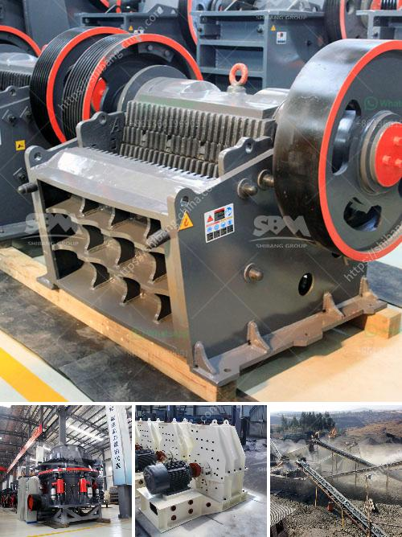

<h3>crusher price of nigeria</h3>
Nigeria, as one of the largest economies in Africa, has a significant demand for construction and mining equipment. Over the years, the country has witnessed an increase in the number of construction projects, which has led to a surge in the demand for crushers. Crushers are essential machines used to break down large rocks and stones into smaller pieces for various purposes such as construction, road building, and mining.

The price of crushers in Nigeria is influenced by several factors, including the quality, brand, model, and manufacturer. The primary types of crushers available in the market are jaw crushers, impact crushers, cone crushers, and gyratory crushers. Each type caters to different crushing needs and comes at varying price ranges.

Jaw crushers are the most widely used and commonly found crushers in Nigeria. They are known for their simplicity and versatility in crushing various materials. The price of jaw crushers in Nigeria ranges from ₦2,000,000 to ₦5,000,000 depending on the specific model, capacity, and manufacturer.

Impact crushers, often used for secondary or tertiary crushing, have higher production capacities compared to jaw crushers. Their prices in Nigeria vary from ₦3,000,000 to ₦6,000,000 depending on the specific model, capacity, and manufacturer.

Cone crushers are suitable for crushing various hard and medium-hard rocks and ores, and are commonly used as secondary or tertiary crushers. The price range of cone crushers in Nigeria is between ₦3,500,000 and ₦10,000,000, depending on the specific model, capacity, and manufacturer.

Gyratory crushers, although less common in Nigeria, are high-capacity crushers that are ideal for large-scale mining and heavy-duty applications. The price of gyratory crushers in Nigeria ranges from ₦10,000,000 to ₦30,000,000 depending on the specific model, capacity, and manufacturer.

Apart from the type and model, other factors such as after-sales service, spare parts availability, and warranty also influence the price of crushers. Established brands often have higher prices due to their reputation, reliability, and customer support. In contrast, lesser-known brands may offer lower prices but might lack the same level of quality and customer support.

It is worth noting that the price of crushers in Nigeria can vary significantly over time due to factors such as currency exchange rates, inflation, and changes in manufacturing costs. Therefore, it is advisable to conduct thorough market research, compare prices from different manufacturers, and consult with industry professionals to make an informed purchasing decision.

In conclusion, the price of crushers in Nigeria depends on various factors such as the type, model, capacity, and manufacturer. Buyers should consider their specific crushing needs, budget, and long-term requirements before making a purchase. Investing in a reliable and efficient crusher is crucial for construction and mining projects in Nigeria, and choosing the right equipment can contribute to the success and profitability of these ventures.
<h3>Contact us</h3><ul><li><strong>Whatsapp:&nbsp;<a href="https://wa.me/8613661969651">+8613661969651</a></strong></li><li><a href="https://swt.shibang-china.com/?git&amp;zhl&amp;crusher price of nigeria"><strong>Online Service(chat now)</strong></a></li></ul><h3>Related</h3><ul><li><a href='price of ballast per ton in kenya.md'>price of ballast per ton in kenya</a></li><li><a href='small limestone plant.md'>small limestone plant</a></li><li><a href='german technical semi mobile crusher.md'>german technical semi mobile crusher</a></li><li><a href='canadia crusher portable chassis.md'>canadia crusher portable chassis</a></li><li><a href='feasibility on quarry business.md'>feasibility on quarry business</a></li></ul>