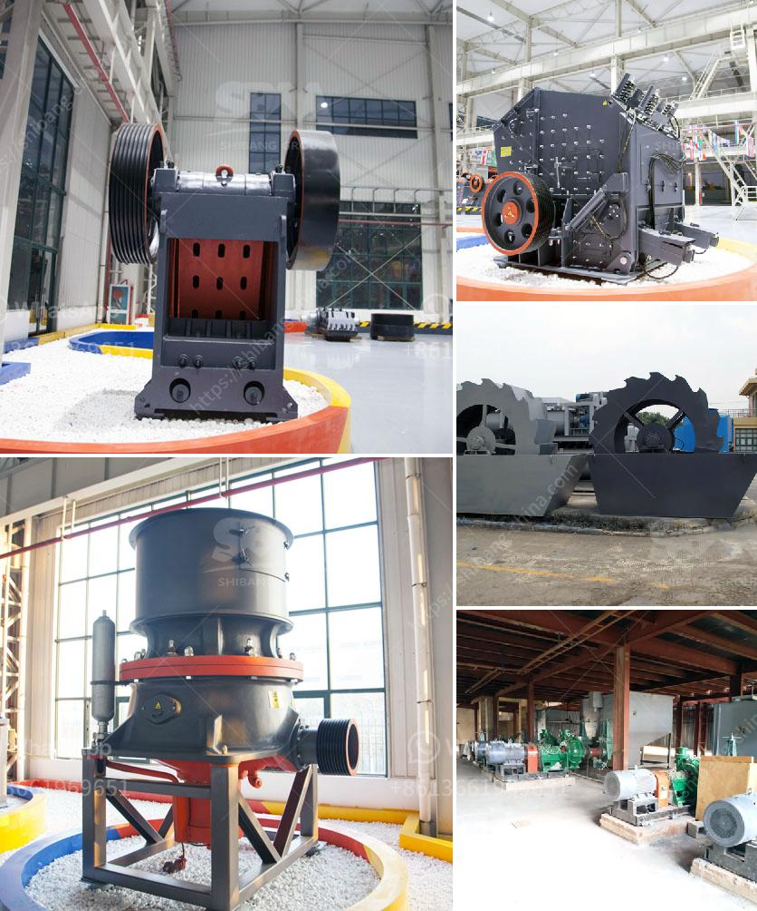

<h3>crusher price peru stone</h3>
Peru, as a developing country, has a vast potential in the mining industry. There are abundant mineral resources in the Andes mountains and coastal areas, making Peru a major producer of metals and minerals worldwide. The stone industry, in particular, has seen remarkable growth in recent years, with increasing demand for crushed stones in construction and infrastructure projects.

When it comes to purchasing crushers in Peru, the price and quality are two critical factors that customers consider. In this article, we will discuss the crusher price for Peru stone and emphasize the importance of quality.

The price of crushers may vary depending on several factors, including the type, capacity, and brand. In Peru, there are various types of crushers available, such as jaw crushers, impact crushers, cone crushers, and hammer crushers, each with its specific advantages and applications. The price range for these crushers can be quite broad, ranging from a few thousand dollars to several hundred thousand dollars.

One of the key factors influencing the price is the crusher's capacity. Higher capacity crushers generally have a higher price tag, as they are designed to handle larger volumes of materials. For instance, a crusher with a higher capacity is suitable for large-scale mining operations or big construction projects.

Brand reputation also plays a role in determining crusher prices. Well-established brands with a long history of delivering reliable and efficient crushers tend to have higher prices. These brands typically invest heavily in research and development to ensure their products are at the forefront of technological advancements, providing customers with top-notch performance and durability.

However, price should not be the only consideration when purchasing crushers in Peru. Quality is equally important, if not more so. Investing in a high-quality crusher can often be more cost-effective in the long run, as it ensures better performance, reduced downtime, and lower maintenance costs.

A high-quality crusher is built with robust materials and precision engineering to withstand the demanding conditions of mining and construction environments. It incorporates advanced features and cutting-edge technology to maximize productivity and efficiency. Additionally, these crushers often come with warranties and after-sales support, ensuring customer satisfaction and peace of mind.

To ensure quality, it is advisable to choose crushers from reputable manufacturers or authorized distributors. These suppliers often adhere to stringent quality control measures and industry standards, providing customers with reliable and durable products.

While price is undeniably a crucial consideration, it should not override the importance of quality when purchasing crushers for Peru stone industry. A cheap but low-quality crusher may result in frequent breakdowns, higher maintenance costs, and ultimately, unsatisfactory performance. By investing in a high-quality crusher, customers can enjoy long-term benefits in terms of productivity, efficiency, and overall operational costs.

In conclusion, when considering crusher prices for Peru stone industry, it is essential to strike a balance between affordability and quality. While cost plays a significant role, investing in a reliable and durable crusher should be the top priority. By choosing a high-quality crusher from reputable manufacturers, customers can ensure optimal performance, reduced maintenance costs, and enhanced productivity in their stone crushing operations.
<h3>Contact us</h3><ul><li><strong>Whatsapp:&nbsp;<a href="https://wa.me/8613661969651">+8613661969651</a></strong></li><li><a href="https://swt.shibang-china.com/?git&amp;zhl&amp;crusher price peru stone"><strong>Online Service(chat now)</strong></a></li></ul><h3>Related</h3><ul><li><a href='hydraulic driven track mobile plant.md'>hydraulic driven track mobile plant</a></li><li><a href='rent a conveyor belts singapur.md'>rent a conveyor belts singapur</a></li><li><a href='conveyor belt supplier in riyadh.md'>conveyor belt supplier in riyadh</a></li><li><a href='marble crusher manufacturer.md'>marble crusher manufacturer</a></li><li><a href='ball mill machine.md'>ball mill machine</a></li></ul>