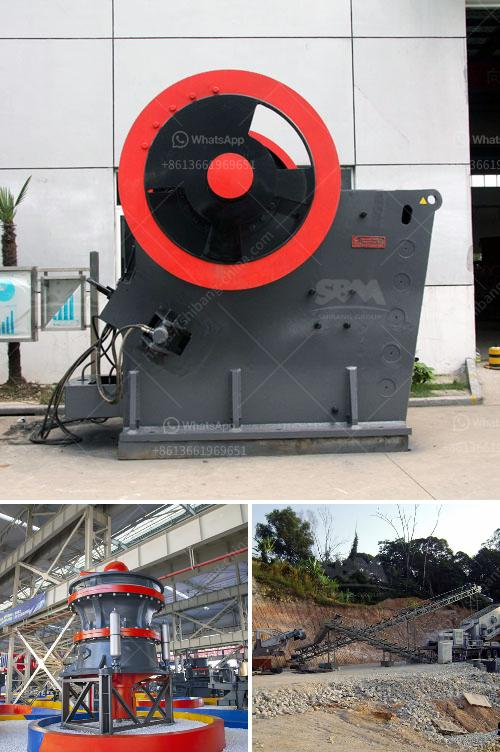

<h3>crusher sells stone crusher malaysia</h3>
In recent years, Malaysia's economy has experienced a steady growth rate. A surge in construction projects means that there is an increased demand for reliable machinery, especially efficient crushers. Known for their rugged design and durability, stone crushers are widely used in the construction industry to crush stones into desired sizes. With advancements in technology, crusher manufacturers are constantly introducing new crushers that offer better productivity, fuel efficiency, and ease of operation. One such manufacturer that has established a strong foothold in the Malaysian market is Crusher.

Crusher is a leading Italian manufacturer of crushing and screening equipment that offers a full range of crushers, screens, and accessories. Designed for various applications, their machines are renowned for their strength and reliability. With their innovative designs and superior engineering, Crusher machines have revolutionized the industry.

One of the key features of Crusher machines is their versatility. The company offers a wide range of stone crushers that can be used for various purposes. From primary crushers that break down large stones into smaller sizes, to secondary and tertiary crushers that produce aggregate for construction projects, Crusher machines deliver consistent performance.

In addition to their versatility, Crusher machines are known for their fuel efficiency. With rising fuel costs and environmental concerns, energy-saving equipment has become a priority for many businesses. Crusher machines are designed to minimize fuel consumption while delivering maximum performance. This allows contractors to complete their projects on time and within budget, without compromising on quality.

Another noteworthy aspect of Crusher machines is their ease of operation. With user-friendly controls and intuitive interfaces, these machines are easy to operate, even for inexperienced users. Additionally, Crusher provides comprehensive training and after-sales support to ensure that their customers get the most out of their equipment.

With a growing number of construction projects in Malaysia, demand for stone crushers is at an all-time high. Recognizing the potential in the Malaysian market, Crusher has established a strong presence by partnering with local distributors. This allows the company to provide timely and efficient service to its customers.

Crusher's commitment to quality and customer satisfaction has earned them a solid reputation in the Malaysian market. Their machines have been widely used in many prestigious projects across the country, contributing to the development of Malaysia's infrastructure.

In conclusion, Crusher is a reliable and efficient solution provider for the crushing and screening industry in Malaysia. With their advanced technology and top-notch after-sales support, Crusher machines are setting new standards for the industry. Whether it's for small-scale construction projects or large-scale infrastructure development, Crusher offers a range of stone crushers that are guaranteed to deliver superior performance. As Malaysia continues to experience economic growth, the demand for reliable and efficient crushers will only increase, making Crusher the perfect choice for businesses in the industry.
<h3>Contact us</h3><ul><li><strong>Whatsapp:&nbsp;<a href="https://wa.me/8613661969651">+8613661969651</a></strong></li><li><a href="https://swt.shibang-china.com/?git&amp;zhl&amp;crusher sells stone crusher malaysia"><strong>Online Service(chat now)</strong></a></li></ul><h3>Related</h3><ul><li><a href='mining process of dolomite ryamond mill in kenya.md'>mining process of dolomite ryamond mill in kenya</a></li><li><a href='artificial stone production line floor.md'>artificial stone production line floor</a></li><li><a href='indonesia crushers of how much price.md'>indonesia crushers of how much price</a></li><li><a href='vertical mill working principle of the hydraulic.md'>vertical mill working principle of the hydraulic</a></li><li><a href='sizes of vertical shaft kilns.md'>sizes of vertical shaft kilns</a></li></ul>