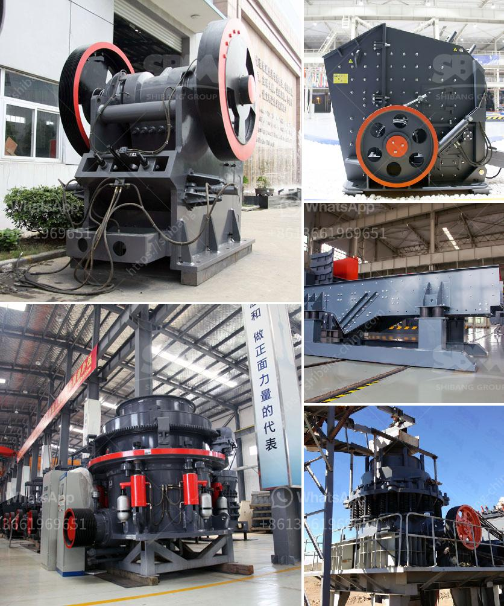

<h3>crusher supplier pakistan</h3>
In the stone crushing industry, crushers are used to break down large stones into smaller pieces. These machines are indispensable when it comes to producing consistent and high-quality aggregates used in construction projects. In Pakistan, crusher machines are crucial for the development of infrastructure, industrial sectors, and private housing projects.

A crusher supplier in Pakistan can provide the latest industry trends, competitive pricing, and reliable models. Today, machines with advanced technology are highly preferred because they offer not only efficient performance but also durability and optimum production capacity. Efficiency is vital because it determines the output per unit time, reducing operational costs and maximizing profit margins. Additionally, a durable crusher ensures minimal downtime and maintenance cost, thereby enhancing the overall productivity of the crushing process.

The importance of choosing the right crusher supplier in Pakistan cannot be understated. Collaborating with a reliable supplier ensures that you are investing in reliable equipment that will run smoothly for years to come. It also enables access to professional guidance and support throughout the lifecycle of the machine. Hence, selecting a supplier who has a strong track record and a reputation for delivering excellent customer service is crucial.

A reputable crusher supplier in Pakistan should offer a wide range of machines to suit different crushing applications. From primary jaw crushers to cone crushers and impact crushers, every type of crusher has been designed to meet specific crushing needs. The crushing equipment is built with robust materials and components to withstand the toughest conditions and deliver consistent performance.

In addition to the quality of machines, a crusher supplier should prioritize after-sales service. Timely supply of spare parts and quick assistance during breakdowns and emergencies are essential to ensure uninterrupted production. An experienced supplier will have a well-established network of service centers and skilled technicians to cater to any maintenance or repair requirements promptly.

Moreover, a crusher supplier should also take environmental considerations into account. The demand for eco-friendly and sustainable crushing solutions is on the rise globally. Therefore, it is essential to find a supplier who promotes efficient energy management and implements dust control measures to minimize pollution during the crushing process.

Furthermore, a reliable crusher supplier should offer competitive pricing without compromising on the quality of their machines. The supplier should have a transparent pricing structure that provides value for money to the customers. They should also offer flexible payment options and financing solutions to facilitate the purchase of machines for small to medium-sized businesses.

To sum up, choosing the right crusher supplier in Pakistan is pivotal for the success of construction projects, mining operations, and private housing ventures. The machines provided by a reputable supplier should feature advanced technology, durability, and high productivity. Additionally, outstanding after-sales service, environmental consciousness, and competitive pricing are equally important factors to consider when selecting a supplier. By partnering with a reliable crusher supplier, businesses can ensure efficient crushing operations, boost productivity, and enhance profitability for years to come.
<h3>Contact us</h3><ul><li><strong>Whatsapp:&nbsp;<a href="https://wa.me/8613661969651">+8613661969651</a></strong></li><li><a href="https://swt.shibang-china.com/?git&amp;zhl&amp;crusher supplier pakistan"><strong>Online Service(chat now)</strong></a></li></ul><h3>Related</h3><ul><li><a href='stone crusher plant.md'>stone crusher plant</a></li><li><a href='copper ore concentration processing.md'>copper ore concentration processing</a></li><li><a href='stone crusher china.md'>stone crusher china</a></li><li><a href='specification for stone crushing for roads.md'>specification for stone crushing for roads</a></li><li><a href='types of coal crusher.md'>types of coal crusher</a></li></ul>