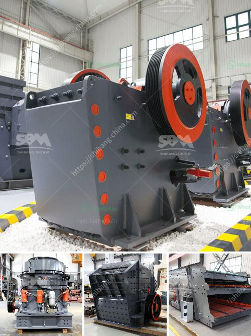

<h3>crusher unit manufacturer india</h3>
Crusher unit manufacturers play a crucial role in the mining industry. Mining is a prominent industry that requires heavy machinery to break down different materials to manageable sizes. Crushers are an essential part of this process, as they help reduce the size of larger materials into smaller particles for further processing. In India, crusher unit manufacturers are witnessing a steady rise in demand for crushers in the mining industry.

Construction projects in India have been on the rise in recent years, and this has led to a surge in the demand for crushers. With the growing need for housing and infrastructure projects, there is a huge demand for aggregates, which are produced by crushing large rocks and stones. Crusher manufacturers in India are focusing on providing high-quality crushers to meet the ever-increasing demand for aggregates that are used for various construction activities.

A crusher unit consists of various types of machines, such as jaw crushers or impact crushers, which are used to break down larger rocks into smaller, more manageable sizes. These machines are commonly used in mining, metallurgy, building materials, highways, railways, water conservancy, and chemical industries. Crusher unit manufacturers in India offer a wide range of crushers for various projects, ensuring that all your crushing needs are met efficiently and effectively.

One of the leading crusher unit manufacturers in India is Propel Industries. They offer advanced and high-performing crushers that are designed to provide maximum productivity at minimal operating costs. Propel crushers are known for their reliable performance, durability, and low maintenance requirements. They provide solutions for both primary and secondary crushing, catering to a wide range of applications.

Another prominent crusher unit manufacturer in India is Nesans Mining and Automation Pvt Ltd. They offer a comprehensive range of crushers that are designed to meet the requirements of various industries. Nesans crushers are known for their robust construction, easy operation, and high productivity. They have a wide range of crushers, including jaw crushers, cone crushers, and vertical shaft impactors.

Apart from these two manufacturers, there are several other crusher unit manufacturers in India who are known for their exceptional quality and reliable performance. These manufacturers use advanced technology and innovative designs to deliver crushers that are efficient, durable, and cost-effective.

The crusher unit manufacturers in India are constantly striving to improve the efficiency and productivity of their machines. They are investing in research and development to introduce innovative features and technologies in their crushers. This ensures that their crushers are at par with the global standards and meet the evolving needs of the mining industry in India.

In conclusion, crusher unit manufacturers in India are playing a vital role in meeting the ever-increasing demand for crushers in the mining industry. With the growing need for aggregates in construction projects, crusher manufacturers are focused on delivering high-quality machines that are efficient, durable, and cost-effective. The industry is witnessing a surge in demand for crushers, and manufacturers are constantly innovating to meet these demands. With their advanced technology and superior quality, crusher unit manufacturers in India are poised to make a significant contribution to the growth of the mining industry in the country.
<h3>Contact us</h3><ul><li><strong>Whatsapp:&nbsp;<a href="https://wa.me/8613661969651">+8613661969651</a></strong></li><li><a href="https://swt.shibang-china.com/?git&amp;zhl&amp;crusher unit manufacturer india"><strong>Online Service(chat now)</strong></a></li></ul><h3>Related</h3><ul><li><a href='crusher operator salary in uae and dubai.md'>crusher operator salary in uae and dubai</a></li><li><a href='cement plant production line.md'>cement plant production line</a></li><li><a href='steel slag recycling plant.md'>steel slag recycling plant</a></li><li><a href='dubai dolomite crusher suppliers.md'>dubai dolomite crusher suppliers</a></li><li><a href='graphite powder processing equipment.md'>graphite powder processing equipment</a></li></ul>