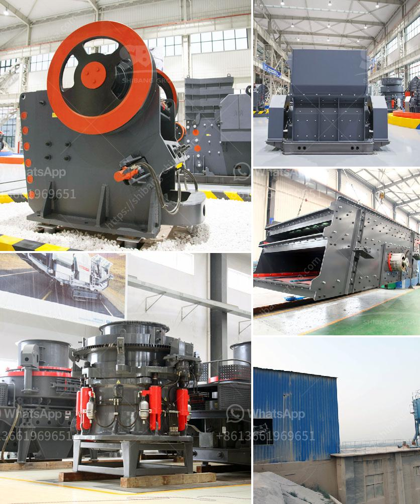

<h3>crusher vsi machine in bangalore</h3>
The Crusher VSI machine is a revolutionary invention that has paved the way for advancements in the construction industry. This innovative machine is a product of the latest technology and research by experts in the field. It is known for its efficiency and ability to produce high-quality sand and aggregates, making it an essential tool for any construction project in Bangalore.

One of the key features of the Crusher VSI machine is its ability to crush rocks into smaller, more manageable sizes. This is done through a process known as crushing, which involves applying force to break down larger rocks into smaller pieces. The machine uses a high-speed rotor and anvils to achieve this, resulting in finely crushed materials that are ideal for various construction applications.

Another advantage of the Crusher VSI machine is its versatility. It can be used to produce different types of crushed materials, including sand and aggregates. This makes it suitable for a wide range of construction projects, such as road construction, building construction, and even landscaping. The machine allows for customization of the output size, giving construction professionals the flexibility to meet specific project requirements.

Furthermore, the Crusher VSI machine is designed to maximize efficiency and minimize waste. It operates on the principle of autogenous crushing, where rocks are crushed by impacting each other. This reduces the need for additional crushing stages and saves energy. It also ensures that no oversized materials are produced, reducing the amount of waste generated.

The Crusher VSI machine also boasts a low maintenance requirement. Its design and construction ensure durability and reliability, resulting in fewer breakdowns and minimal downtime. The machine is built to withstand heavy use and harsh conditions, making it suitable for construction projects in Bangalore, where the environment can be demanding. Regular maintenance and servicing are recommended to keep the machine in optimum working condition and prolong its lifespan.

In conclusion, the Crusher VSI machine has revolutionized the construction industry in Bangalore. Its ability to crush rocks into high-quality sand and aggregates makes it an essential tool for any construction project. The machine's versatility, efficiency, and low maintenance requirement make it a valuable asset for construction professionals. With the Crusher VSI machine, construction projects in Bangalore can be completed more efficiently, resulting in higher-quality outcomes and reduced costs.
<h3>Contact us</h3><ul><li><strong>Whatsapp:&nbsp;<a href="https://wa.me/8613661969651">+8613661969651</a></strong></li><li><a href="https://swt.shibang-china.com/?git&amp;zhl&amp;crusher vsi machine in bangalore"><strong>Online Service(chat now)</strong></a></li></ul><h3>Related</h3><ul><li><a href='chrome beneficiation plant china.md'>chrome beneficiation plant china</a></li><li><a href='quartz marble making machine.md'>quartz marble making machine</a></li><li><a href='gypsum powder making plant.md'>gypsum powder making plant</a></li><li><a href='complete stone crusher set.md'>complete stone crusher set</a></li><li><a href='small crusher project.md'>small crusher project</a></li></ul>