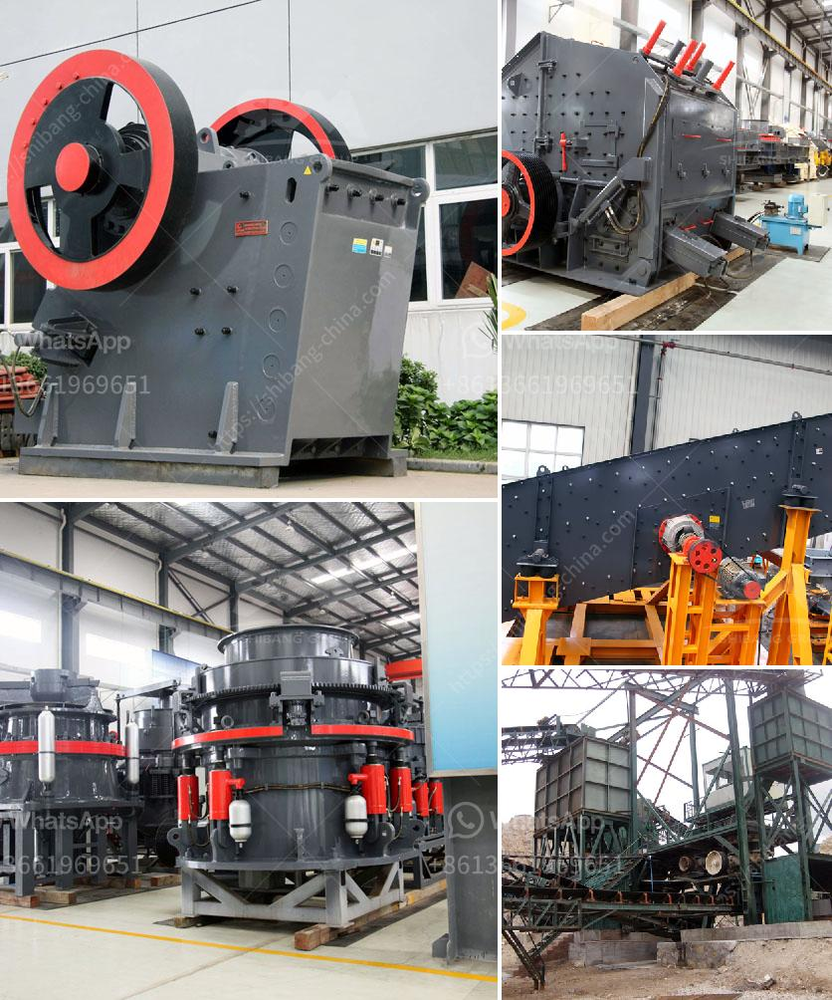

<h3>crushers and screeners for hire in usa</h3>
Crushers and screeners play a crucial role in various industries, including construction, mining, and recycling. These powerful machines are used to process materials such as rocks, concrete, and demolition waste into a more manageable and reusable form. In the United States, the demand for crushers and screeners for hire has been on the rise, thanks to the need for efficient material processing solutions.

One of the key benefits of hiring crushers and screeners is that it allows businesses to save both time and money. By renting these machines instead of purchasing them, companies can avoid the high initial capital investment associated with buying new equipment. Additionally, maintenance and repair costs are typically covered by the rental company, further reducing the financial burden on the business.

Another advantage is the flexibility that hiring provides. Different projects have different requirements, and by opting to hire crushers and screeners, companies can easily adapt their equipment to suit the specific needs of each job. This versatility enables businesses to be more agile and meet evolving customer demands effectively.

Moreover, hiring crushers and screeners from a reputable supplier ensures access to the latest and most advanced equipment. Rental companies regularly update their fleets to keep up with technological advancements. This means that businesses can benefit from cutting-edge machinery without having to invest in costly upgrades themselves.

When considering crushers and screeners for hire, it is important to choose a reliable and experienced supplier. A reputable rental company will offer a wide range of equipment options, ensuring that businesses can find the right machine for their specific needs. They will also provide excellent customer support, including assistance with the setup and operation of the equipment.

In conclusion, hiring crushers and screeners in the United States can provide numerous benefits for businesses in various industries. From cost savings and flexibility to access to advanced machinery, renting these machines offers a strategic solution for efficient material processing. By partnering with a reliable rental company, businesses can boost productivity, minimize downtime, and streamline operations in a cost-effective manner.
<h3>Contact us</h3><ul><li><strong>Whatsapp:&nbsp;<a href="https://wa.me/8613661969651">+8613661969651</a></strong></li><li><a href="https://swt.shibang-china.com/?git&amp;zhl&amp;crushers and screeners for hire in usa"><strong>Online Service(chat now)</strong></a></li></ul><h3>Related</h3><ul><li><a href='jaw crusher machine price.md'>jaw crusher machine price</a></li><li><a href='vertical mill rock.md'>vertical mill rock</a></li><li><a href='silica washing plant.md'>silica washing plant</a></li><li><a href='ball mill fly ash.md'>ball mill fly ash</a></li><li><a href='crusher dealers in cebu.md'>crusher dealers in cebu</a></li></ul>