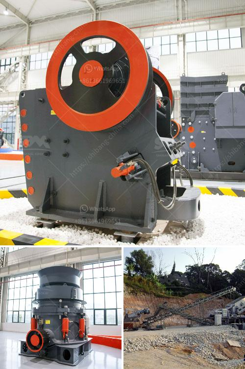

<h3>crushers machines for sale in south africa</h3>
South Africa is rich in mineral assets and it is a major producer of minerals in the world. In recent years, many mining company officials have stated that South Africa will remain one of the most significant global mining hubs, attributing this prediction to an abundance of resources, technological advancements, and sound political stability.

Mining is an integral part of the country's economy, and crushers machines are widely utilized in the mining industry. Crushers are essential machines that help break down large rocks or ores into smaller, more manageable pieces. They are typically used in various stages of the mining process to reduce the size of raw materials for further processing.

Due to the high demand for crushers in South Africa’s mining industry, manufacturers have been continuously developing and improving these machines to meet the specific needs of customers. Today, various types of crushers machines are available for sale in the country, catering to different applications and industries.

Jaw crushers are widely used in the primary crushing stage and are primarily responsible for reducing large rocks into smaller sizes. They are equipped with a fixed jaw plate and a movable jaw plate, which rely on a compressive force to break down materials effectively.

Cone crushers, on the other hand, are typically used in the secondary and tertiary stages of crushing. They have a cone-shaped crushing chamber and can be adjusted to produce various sizes of the final product. Cone crushers are particularly useful for processing hard and abrasive materials.

Another popular type of crusher machine in South Africa is impact crushers. These machines are designed to produce a high-quality cubical shape by applying a high-speed impact force to crush materials. Impact crushers are often used for recycling or aggregate production.

Overall, crushers machines play a crucial role in the mining industry in South Africa. They help break down raw materials, facilitate efficient mining operations, and contribute to the country's economic growth. With the continuous demand for crushers machines, manufacturers in South Africa are constantly improving their product offerings to provide more reliable, efficient, and environmentally-friendly solutions.

In conclusion, crushers machines for sale in South Africa are essential equipment in the mining industry. These machines help break down large rocks into smaller, more manageable pieces, facilitating the mining process. Jaw crushers, cone crushers, and impact crushers are among the most commonly used types of crushers in South Africa. Mining companies can find a wide range of crushers machines for sale to meet their specific requirements and enhance their mining operations.
<h3>Contact us</h3><ul><li><strong>Whatsapp:&nbsp;<a href="https://wa.me/8613661969651">+8613661969651</a></strong></li><li><a href="https://swt.shibang-china.com/?git&amp;zhl&amp;crushers machines for sale in south africa"><strong>Online Service(chat now)</strong></a></li></ul><h3>Related</h3><ul><li><a href='european stone crusher.md'>european stone crusher</a></li><li><a href='fairly used quarry crusher in nigeria price.md'>fairly used quarry crusher in nigeria price</a></li><li><a href='hammer mill how it works.md'>hammer mill how it works</a></li><li><a href='china quarry plant manufacturers.md'>china quarry plant manufacturers</a></li><li><a href='crusher conveyor philippines.md'>crusher conveyor philippines</a></li></ul>