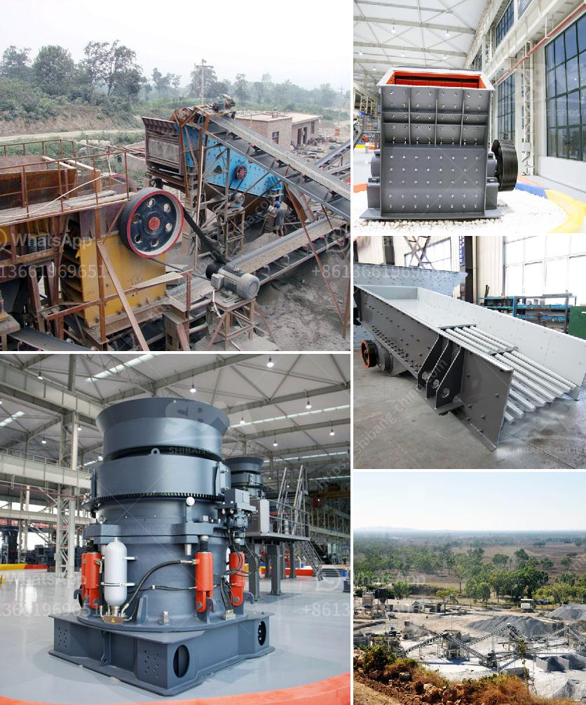

<h3>crushing and mining equipment companies in uae</h3>
Crushing and mining equipment companies in UAE are flourishing amid the ongoing development projects in the region. With major construction projects taking place, the demand for crushing and mining equipment is increasing, attracting companies from around the world to invest in this lucrative market.

UAE, known for its booming construction sector, has become a hub for crushing and mining equipment companies. The country is home to world-class infrastructure projects, such as luxurious hotels, modern skyscrapers, and massive shopping malls, all of which require advanced machinery for construction and maintenance.

These crushing and mining equipment companies are catering to the ever-growing demand by providing efficient and reliable machinery for various mining operations. The equipment includes jaw crushers, cone crushers, impact crushers, and screening plants, among others.

Crushing and mining equipment companies in UAE are not only supplying equipment to the local market but also exporting their products to neighboring countries in the Middle East and Africa. This has given them a competitive edge and allowed them to establish a strong foothold in the industry.

The companies invest heavily in research and development to stay ahead of the competition and deliver technologically advanced equipment. They also provide after-sales services, spare parts, and maintenance support to ensure smooth operations for their customers.

In addition to the construction sector, these crushing and mining equipment companies are also supporting the oil and gas industry in UAE. They provide specialized equipment for the extraction and processing of resources, contributing to the country's economic growth and sustainability.

As the demand for construction materials and minerals rises, crushing and mining equipment companies in UAE are likely to witness further growth in the coming years. However, they must continue to innovate and adapt to changing market trends to remain competitive and meet the evolving needs of their customers.

In conclusion, crushing and mining equipment companies in UAE are playing a vital role in the region's construction and mining sectors. With their technologically advanced machinery and extensive support services, they are contributing to the development and growth of the UAE's economy.
<h3>Contact us</h3><ul><li><strong>Whatsapp:&nbsp;<a href="https://wa.me/8613661969651">+8613661969651</a></strong></li><li><a href="https://swt.shibang-china.com/?git&amp;zhl&amp;crushing and mining equipment companies in uae"><strong>Online Service(chat now)</strong></a></li></ul><h3>Related</h3><ul><li><a href='jual beli stone crusher bekas.md'>jual beli stone crusher bekas</a></li><li><a href='50 tph raymond mills.md'>50 tph raymond mills</a></li><li><a href='clay grinder machine kerala.md'>clay grinder machine kerala</a></li><li><a href='price of granite jaw crusher.md'>price of granite jaw crusher</a></li><li><a href='used cone crushers zambia.md'>used cone crushers zambia</a></li></ul>