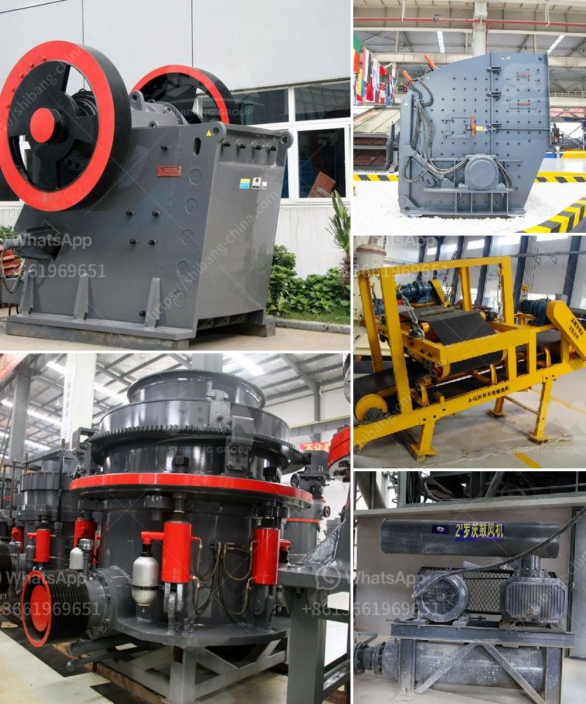

<h3>crushing and screening costs</h3>
Crushing and screening are integral processes in the mining, quarrying, and construction industries. These processes involve breaking down larger pieces of material into smaller sizes, which is then used for various purposes such as aggregates for concrete, rock fill, road base, and asphalt paving. However, it is essential to also consider the costs associated with these processes, as they can significantly impact a project's bottom line.

When it comes to crushing and screening costs, there are several factors to consider. First and foremost is the type and hardness of the material being crushed. Different materials require different types of crushing equipment, which can vary in terms of price. For example, softer materials like limestone may require a lower-capacity jaw crusher, while harder materials like granite or basalt might necessitate a more robust cone or impact crusher, capable of higher production rates. Therefore, the cost of the equipment itself can vary depending on the application and material characteristics.

Apart from the initial purchase cost of the crushing equipment, it is also vital to consider the operating costs. These include fuel, maintenance, and repair costs, as well as the cost of labor. Fuel costs can be a significant expense, particularly for larger crushing operations that consume a substantial amount of energy. Choosing energy-efficient equipment and optimizing the crushing process can help reduce fuel consumption.

Similarly, the cost of maintenance and repairs should not be overlooked. Regular maintenance, such as oil changes, filter replacements, and component inspections, can prevent unexpected breakdowns and prolong the lifespan of the equipment. It is crucial to follow the manufacturer's maintenance guidelines and schedule to ensure optimal performance and minimize repair costs. Additionally, having a well-trained and knowledgeable maintenance team can help identify and address potential issues early on, reducing costly downtime.

Labor costs also play a role in crushing and screening expenses. Skilled operators, technicians, and maintenance personnel are essential for efficient and safe operation. Investing in proper training and ensuring a competent workforce can help maximize productivity and minimize costly mistakes.

Apart from the direct costs associated with crushing and screening, there are also indirect costs to consider. These can include transportation, permits, and environmental regulations. The location of a project site can impact transportation costs, particularly if the material needs to be hauled over long distances. Ensuring compliance with permits and regulations can also involve additional expenses, such as hiring consultants or acquiring specialized equipment.

To minimize crushing and screening costs, it is crucial to take a holistic approach and consider the entire process from material extraction to the end product. Careful planning, equipment selection, and maintenance can help optimize production rates and reduce downtime. Implementing energy-efficient technologies can also lead to cost savings over the long term.

In conclusion, crushing and screening costs can vary depending on factors such as material type, equipment selection, maintenance, labor, transportation, and regulatory compliance. By considering all these factors and taking a comprehensive approach, businesses can better manage their crushing and screening expenses, ultimately improving their profitability and competitiveness in the industry.
<h3>Contact us</h3><ul><li><strong>Whatsapp:&nbsp;<a href="https://wa.me/8613661969651">+8613661969651</a></strong></li><li><a href="https://swt.shibang-china.com/?git&amp;zhl&amp;crushing and screening costs"><strong>Online Service(chat now)</strong></a></li></ul><h3>Related</h3><ul><li><a href='china vertical roller mill.md'>china vertical roller mill</a></li><li><a href='granite grinder and crushers.md'>granite grinder and crushers</a></li><li><a href='size reduction equipment ball mill in details.md'>size reduction equipment ball mill in details</a></li><li><a href='concrete will crusher for sale in uae.md'>concrete will crusher for sale in uae</a></li><li><a href='gypsum powder ball mill machinery.md'>gypsum powder ball mill machinery</a></li></ul>